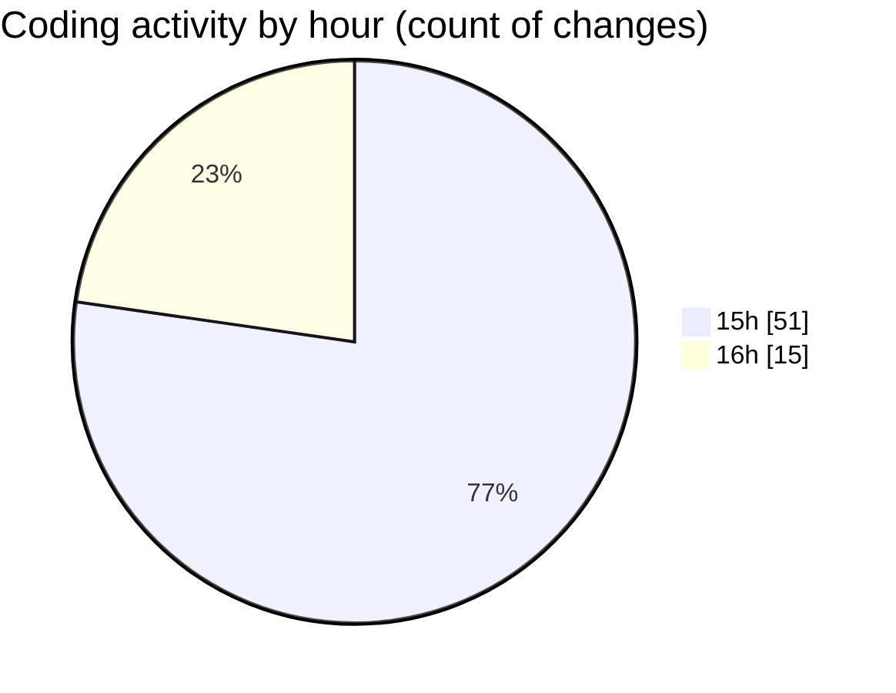

# Elitesun - Activity Summary 

## Overall Statistics

| Stat                   | Value                                                             |
| ---------------------- | ----------------------------------------------------------------- |
| **Lines Added** (➕)   | 22216                                          |
| **Lines Removed** (➖) | 9118                                        |
| **Net Change** (↕)    | 13098                |
| **Active Time** (⌚)   | 88 minutes |

## Modified Files
- **Logo.tsx** (+233, -116)
- **LetterFx.tsx** (+474, -203)
- **Icon.tsx** (+328, -92)
- **HoloFx.tsx** (+323, -163)
- **GlitchFx.tsx** (+222, -112)
- **DropdownWrapper.tsx** (+425, -207)
- **icons.ts** (+91, -8)
- **Projects.tsx** (+77, -40)
- **ProjectCard.tsx** (+180, -93)
- **Header.tsx** (+235, -72)
- **Footer.tsx** (+120, -62)
- **building-once-ui-a-customizable-design-system.mdx** (+92, -47)
- **page.tsx** (+226, -128)
- **content.js** (+926, -300)
- **config.js** (+161, -16)
- **page.tsx** (+224, -115)
- **page.tsx** (+1005, -567)
- **page.tsx** (+350, -156)
- **layout.tsx** (+304, -168)
- **type-dark.svg** (+15, -10)
- **type-light.svg** (+21, -16)
- **next.config.mjs** (+39, -20)
- **package.json** (+143, -46)
- **package-lock.json** (+16002, -6361)

## Visualizations

### By File Type (Lines Changed)

### By Hour (Estimated Activity Count)

> **Last Updated:** 5/10/2025, 4:56:27 PM