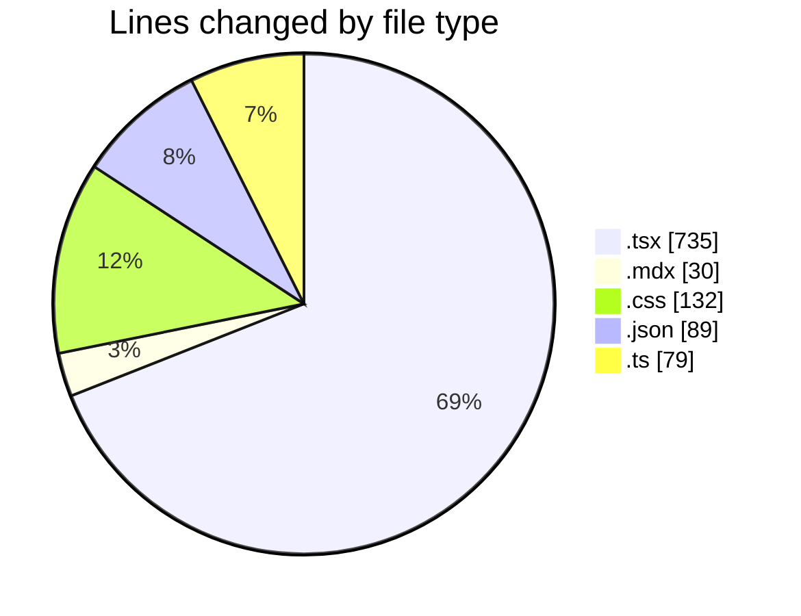
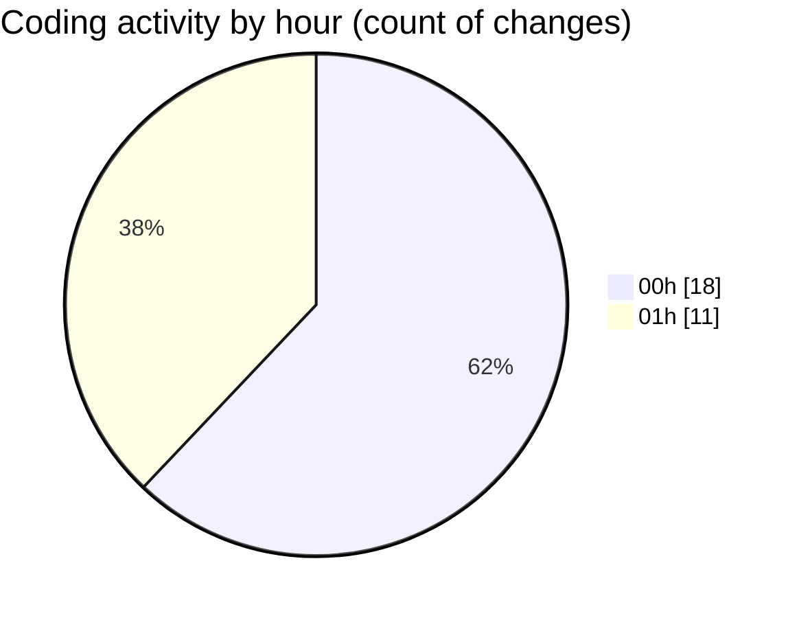

# Elitesun - Activity Summary 

## Overall Statistics

| Stat                   | Value                                                             |
| ---------------------- | ----------------------------------------------------------------- |
| **Lines Added** (➕)   | 886                                          |
| **Lines Removed** (➖) | 179                                        |
| **Net Change** (↕)    | 707                |
| **Active Time** (⌚)   | 45 minutes |

## Modified Files
- **Header.tsx** (+1, -9)
- **Logo.tsx** (+137, -2)
- **More-Recent-designs.mdx** (+0, -30)
- **SideAnimate.tsx** (+268, -133)
- **SideAnimate.module.css** (+132, -0)
- **tsconfig.json** (+35, -0)
- **page.tsx** (+4, -5)
- **package.json** (+54, -0)
- **utils.ts** (+79, -0)
- **bento-grid.tsx** (+55, -0)
- **Blob-cursor.tsx** (+121, -0)

## Visualizations

### By File Type (Lines Changed)

### By Hour (Estimated Activity Count)

> **Last Updated:** 5/12/2025, 1:12:42 AM