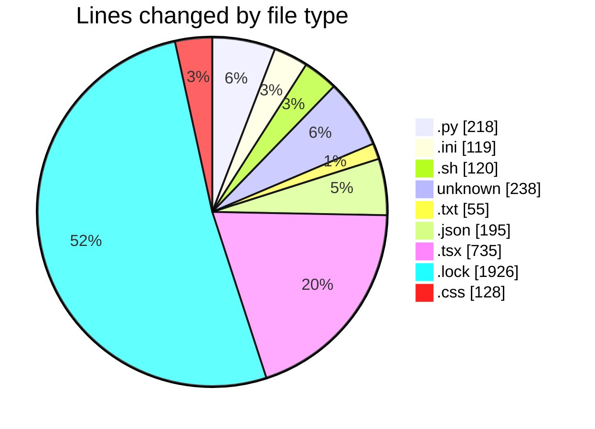
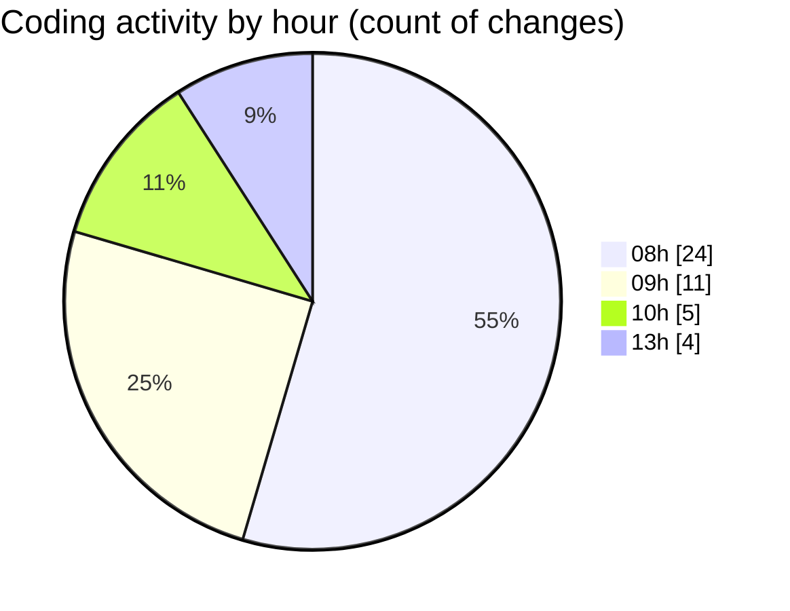

# niten - Activity Summary 

## Overall Statistics

| Stat                   | Value                                                             |
| ---------------------- | ----------------------------------------------------------------- |
| **Lines Added** (➕)   | 3475                                          |
| **Lines Removed** (➖) | 259                                        |
| **Net Change** (↕)    | 3216                |
| **Active Time** (⌚)   | 50 minutes |

## Modified Files
- **env.py** (+103, -6)
- **database.py** (+44, -0)
- **alembic.ini** (+119, -0)
- **entrypoint.sh** (+117, -3)
- **config.py** (+63, -2)
- **Dockerfile** (+155, -13)
- **requirements.txt** (+55, -0)
- **.env** (+70, -0)
- **package.json** (+3, -2)
- **JobDetails.tsx** (+251, -0)
- **page.tsx** (+251, -233)
- **careers.json** (+95, -0)
- **careers.json** (+95, -0)
- **poetry.lock** (+1926, -0)
- **globals.css** (+128, -0)

## Visualizations

### By File Type (Lines Changed)

### By Hour (Estimated Activity Count)

> **Last Updated:** 5/12/2025, 1:39:03 PM