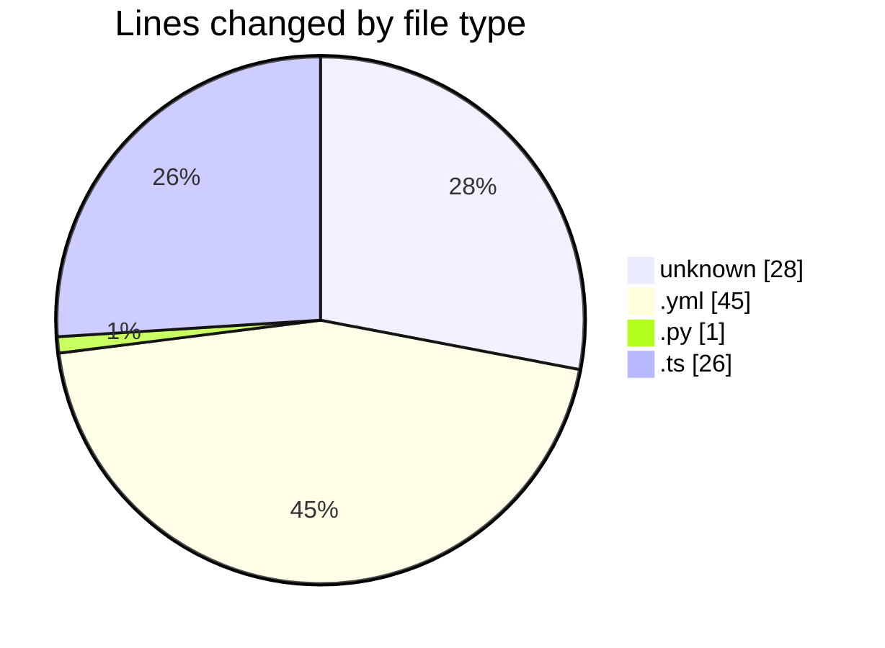
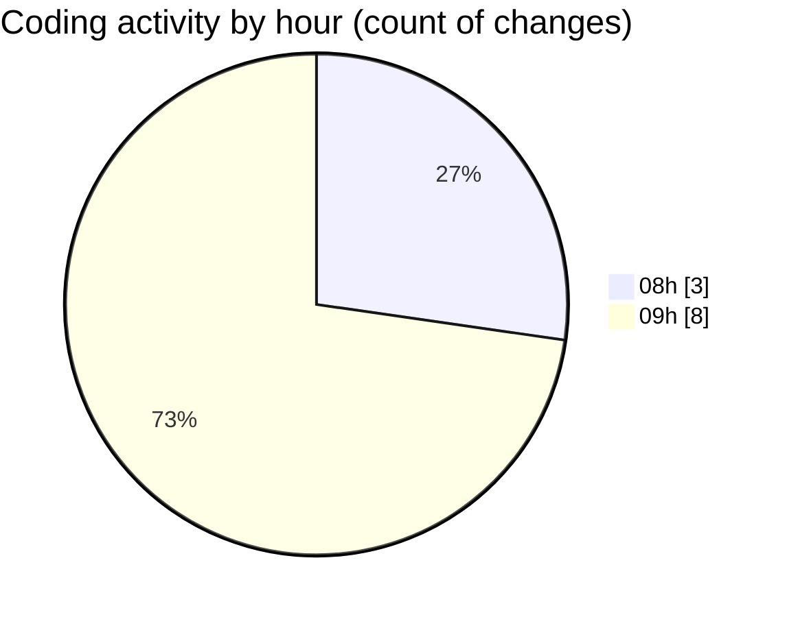

# niten - Activity Summary 

## Overall Statistics

| Stat                   | Value                                                             |
| ---------------------- | ----------------------------------------------------------------- |
| **Lines Added** (➕)   | 70                                          |
| **Lines Removed** (➖) | 30                                        |
| **Net Change** (↕)    | 40                |
| **Active Time** (⌚)   | 18 minutes |

## Modified Files
- **.env** (+11, -14)
- **Dockerfile** (+3, -0)
- **docker-compose.yml** (+29, -16)
- **database.py** (+1, -0)
- **storage.ts** (+26, -0)

## Visualizations

### By File Type (Lines Changed)

### By Hour (Estimated Activity Count)

> **Last Updated:** 5/13/2025, 9:32:44 AM