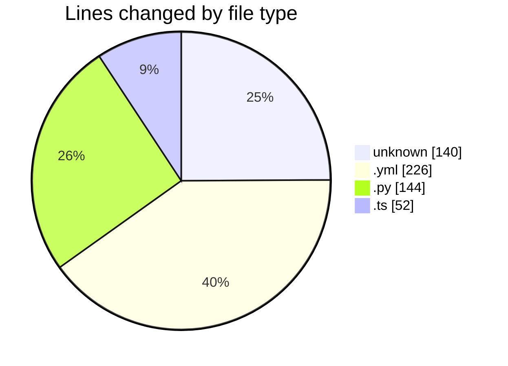
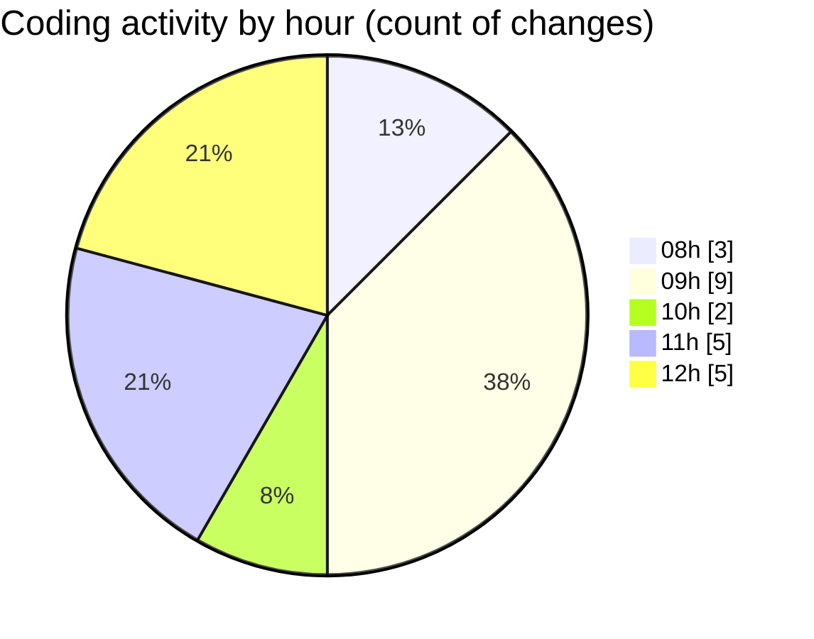

# niten - Activity Summary 

## Overall Statistics

| Stat                   | Value                                                             |
| ---------------------- | ----------------------------------------------------------------- |
| **Lines Added** (➕)   | 492                                          |
| **Lines Removed** (➖) | 70                                        |
| **Net Change** (↕)    | 422                |
| **Active Time** (⌚)   | 32 minutes |

## Modified Files
- **.env** (+49, -14)
- **Dockerfile** (+77, -0)
- **docker-compose.yml** (+170, -56)
- **database.py** (+31, -0)
- **storage.ts** (+52, -0)
- **config.py** (+72, -0)
- **main.py** (+41, -0)

## Visualizations

### By File Type (Lines Changed)

### By Hour (Estimated Activity Count)

> **Last Updated:** 5/13/2025, 12:11:23 PM