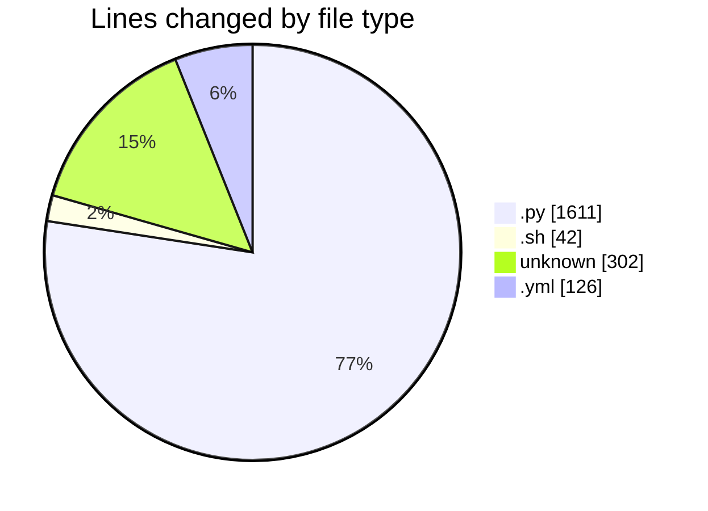
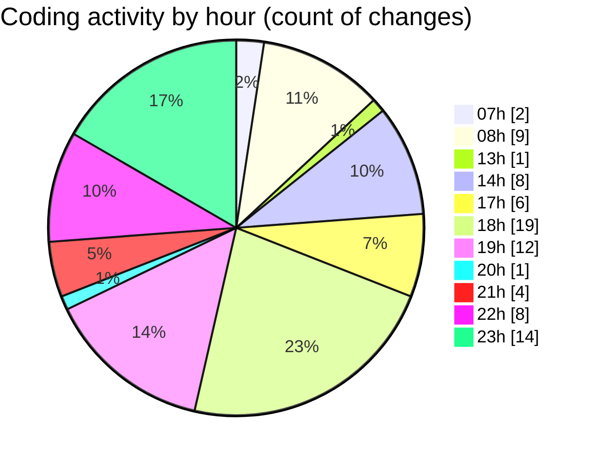

# niten - Activity Summary 

## Overall Statistics

| Stat                   | Value                                                             |
| ---------------------- | ----------------------------------------------------------------- |
| **Lines Added** (➕)   | 1905                                          |
| **Lines Removed** (➖) | 176                                        |
| **Net Change** (↕)    | 1729                |
| **Active Time** (⌚)   | 98 minutes |

## Modified Files
- **jobs.py** (+293, -15)
- **job_service.py** (+242, -0)
- **application_service.py** (+136, -6)
- **storage_service.py** (+105, -16)
- **entrypoint.sh** (+42, -0)
- **Dockerfile** (+74, -0)
- **config.py** (+151, -51)
- **docker-compose.yml** (+112, -14)
- **aws_helpers.py** (+23, -0)
- **.env** (+64, -20)
- **.env** (+33, -31)
- **email_service.py** (+91, -0)
- **careers.py** (+64, -0)
- **careers.py** (+100, -2)
- **.gitignore** (+80, -0)
- **main.py** (+41, -0)
- **router.py** (+8, -0)
- **jobs.py** (+182, -0)
- **base.py** (+12, -0)
- **job.py** (+14, -0)
- **email.py** (+8, -0)
- **database.py** (+8, -0)
- **__init__.py** (+22, -21)

## Visualizations

### By File Type (Lines Changed)

### By Hour (Estimated Activity Count)

> **Last Updated:** 5/14/2025, 11:33:12 PM