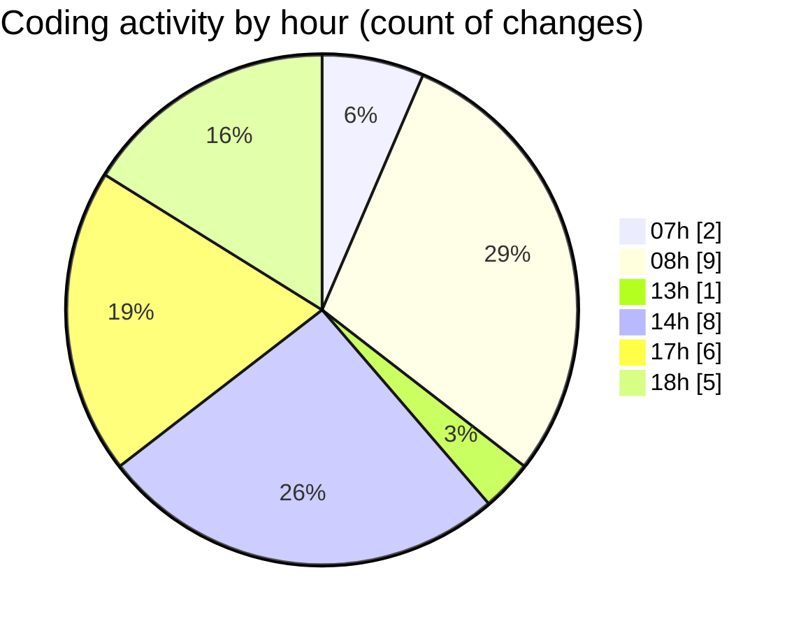

# niten - Activity Summary 

## Overall Statistics

| Stat                   | Value                                                             |
| ---------------------- | ----------------------------------------------------------------- |
| **Lines Added** (➕)   | 839                                          |
| **Lines Removed** (➖) | 84                                        |
| **Net Change** (↕)    | 755                |
| **Active Time** (⌚)   | 34 minutes |

## Modified Files
- **jobs.py** (+121, -8)
- **job_service.py** (+117, -0)
- **application_service.py** (+58, -0)
- **storage_service.py** (+102, -8)
- **entrypoint.sh** (+42, -0)
- **Dockerfile** (+74, -0)
- **config.py** (+94, -27)
- **docker-compose.yml** (+112, -10)
- **aws_helpers.py** (+23, -0)
- **.env** (+63, -0)
- **.env** (+33, -31)

## Visualizations

### By File Type (Lines Changed)

### By Hour (Estimated Activity Count)

> **Last Updated:** 5/14/2025, 6:13:12 PM