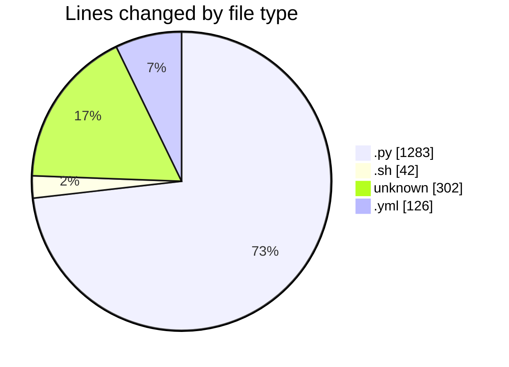
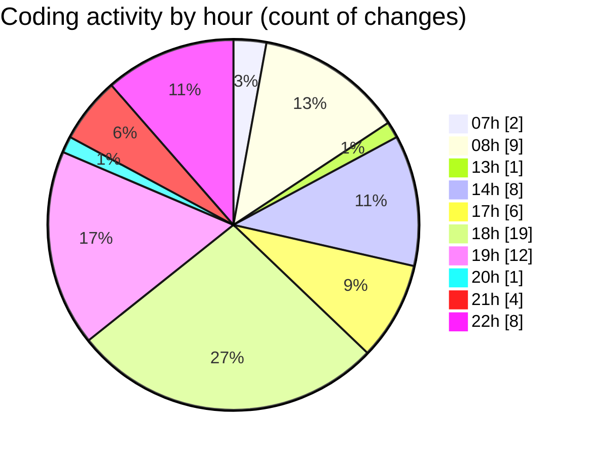

# niten - Activity Summary 

## Overall Statistics

| Stat                   | Value                                                             |
| ---------------------- | ----------------------------------------------------------------- |
| **Lines Added** (➕)   | 1599                                          |
| **Lines Removed** (➖) | 154                                        |
| **Net Change** (↕)    | 1445                |
| **Active Time** (⌚)   | 80 minutes |

## Modified Files
- **jobs.py** (+293, -15)
- **job_service.py** (+234, -0)
- **application_service.py** (+136, -5)
- **storage_service.py** (+102, -16)
- **entrypoint.sh** (+42, -0)
- **Dockerfile** (+74, -0)
- **config.py** (+151, -51)
- **docker-compose.yml** (+112, -14)
- **aws_helpers.py** (+23, -0)
- **.env** (+64, -20)
- **.env** (+33, -31)
- **email_service.py** (+91, -0)
- **careers.py** (+64, -0)
- **careers.py** (+100, -2)
- **.gitignore** (+80, -0)

## Visualizations

### By File Type (Lines Changed)

### By Hour (Estimated Activity Count)

> **Last Updated:** 5/14/2025, 11:03:12 PM