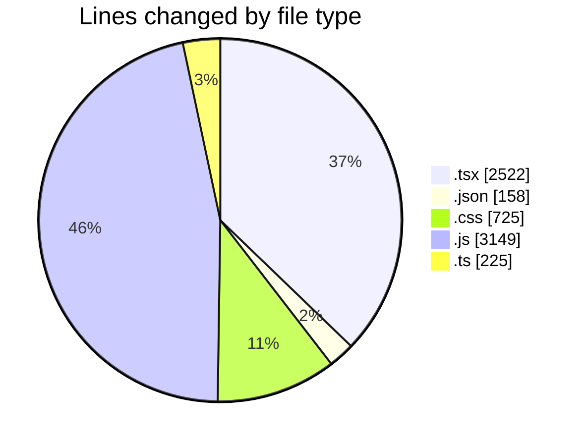
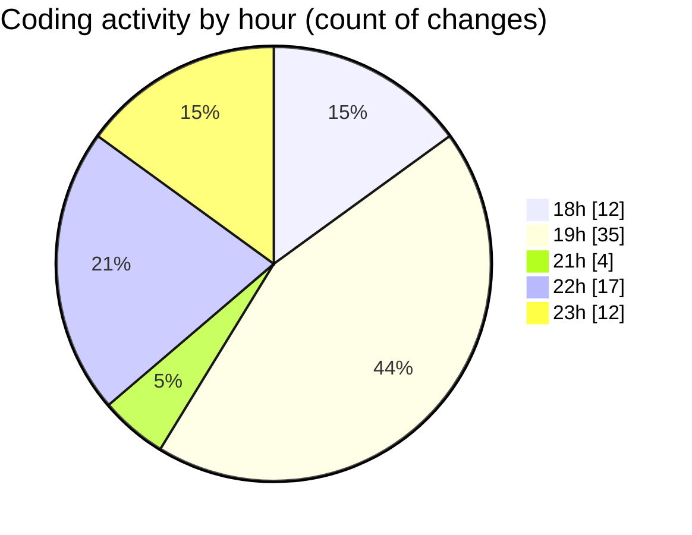

# laala_boost - Activity Summary 

## Overall Statistics

| Stat                   | Value                                                             |
| ---------------------- | ----------------------------------------------------------------- |
| **Lines Added** (➕)   | 6109                                          |
| **Lines Removed** (➖) | 670                                        |
| **Net Change** (↕)    | 5439                |
| **Active Time** (⌚)   | 94 minutes |

## Modified Files
- **page.tsx** (+458, -447)
- **package.json** (+29, -0)
- **globals.css** (+470, -179)
- **tailwind.config.js** (+89, -7)
- **ContentTable.tsx** (+110, -8)
- **Dashboard.tsx** (+162, -11)
- **FilterForm.tsx** (+159, -0)
- **use-mobile.tsx** (+20, -0)
- **use-toast.ts** (+192, -0)
- **use-toast.ts** (+3, -0)
- **Toaster.tsx** (+33, -0)
- **toast.tsx** (+128, -0)
- **styles.css** (+76, -0)
- **_5286fa20._.js** (+1575, -0)
- **[root-of-the-server]__cee39406._.js** (+1478, -0)
- **collection.json** (+63, -0)
- **laala.json** (+66, -0)
- **page.tsx** (+235, -18)
- **page.tsx** (+460, -0)
- **page.tsx** (+273, -0)
- **next.config.ts** (+30, -0)

## Visualizations

### By File Type (Lines Changed)

### By Hour (Estimated Activity Count)

> **Last Updated:** 5/15/2025, 11:50:22 PM