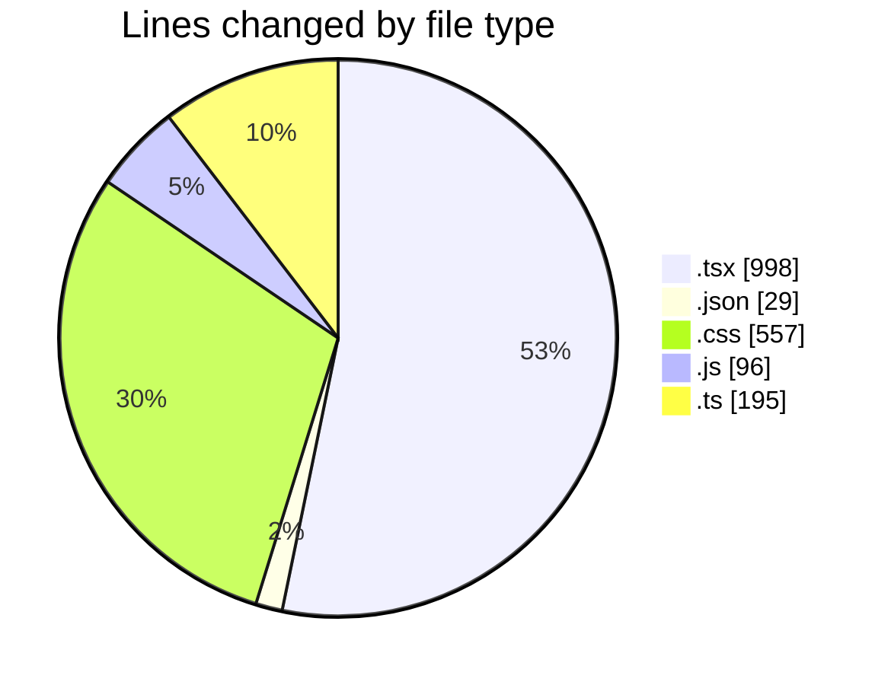
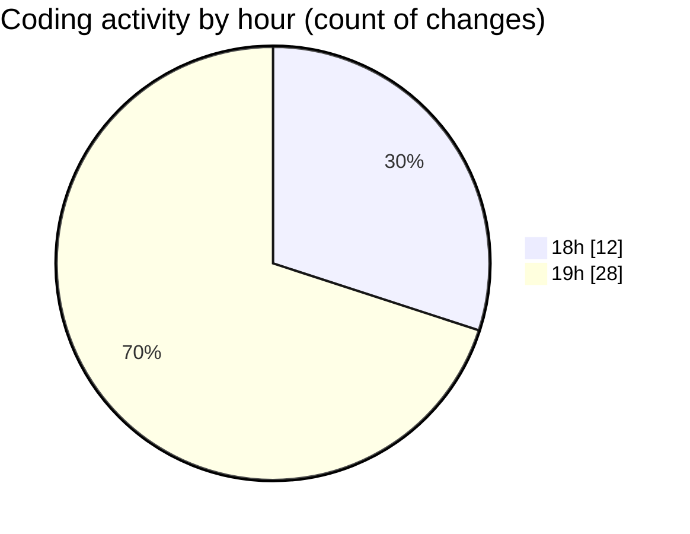

# laala_boost - Activity Summary 

## Overall Statistics

| Stat                   | Value                                                             |
| ---------------------- | ----------------------------------------------------------------- |
| **Lines Added** (➕)   | 1434                                          |
| **Lines Removed** (➖) | 441                                        |
| **Net Change** (↕)    | 993                |
| **Active Time** (⌚)   | 47 minutes |

## Modified Files
- **page.tsx** (+266, -255)
- **package.json** (+29, -0)
- **globals.css** (+378, -179)
- **tailwind.config.js** (+89, -7)
- **ContentTable.tsx** (+58, -0)
- **Dashboard.tsx** (+141, -0)
- **FilterForm.tsx** (+97, -0)
- **use-mobile.tsx** (+20, -0)
- **use-toast.ts** (+192, -0)
- **use-toast.ts** (+3, -0)
- **Toaster.tsx** (+33, -0)
- **toast.tsx** (+128, -0)

## Visualizations

### By File Type (Lines Changed)

### By Hour (Estimated Activity Count)

> **Last Updated:** 5/15/2025, 7:42:33 PM