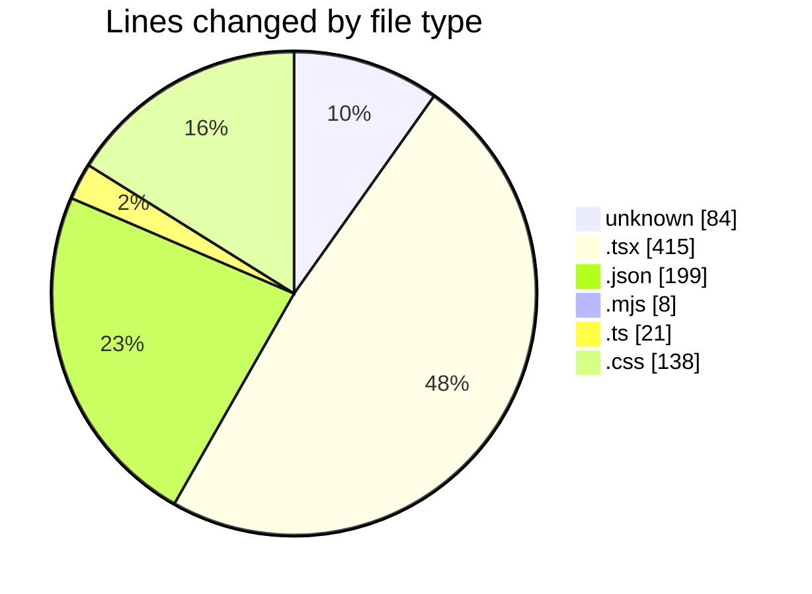
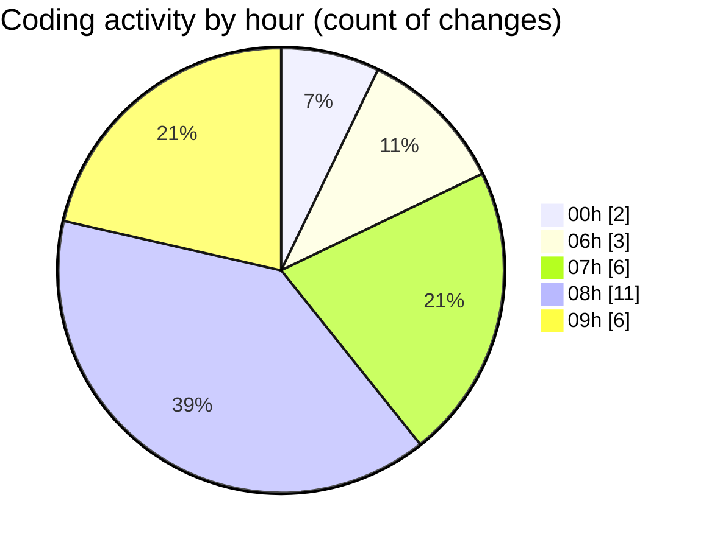

# niten - Activity Summary 

## Overall Statistics

| Stat                   | Value                                                             |
| ---------------------- | ----------------------------------------------------------------- |
| **Lines Added** (➕)   | 790                                          |
| **Lines Removed** (➖) | 75                                        |
| **Net Change** (↕)    | 715                |
| **Active Time** (⌚)   | 29 minutes |

## Modified Files
- **Dockerfile** (+84, -0)
- **page.tsx** (+38, -28)
- **page.tsx** (+238, -2)
- **page.tsx** (+108, -1)
- **tsconfig.json** (+100, -34)
- **package.json** (+65, -0)
- **postcss.config.mjs** (+8, -0)
- **tailwind.config.ts** (+21, -0)
- **globals.css** (+128, -10)

## Visualizations

### By File Type (Lines Changed)

### By Hour (Estimated Activity Count)

> **Last Updated:** 5/15/2025, 9:29:45 AM