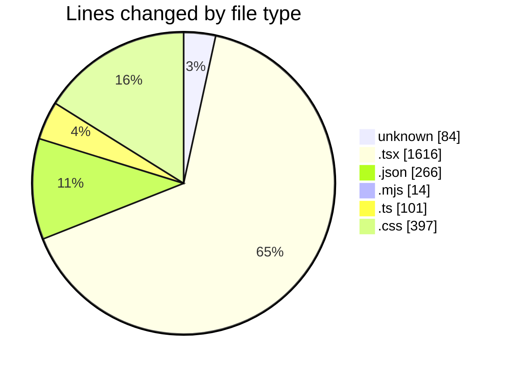
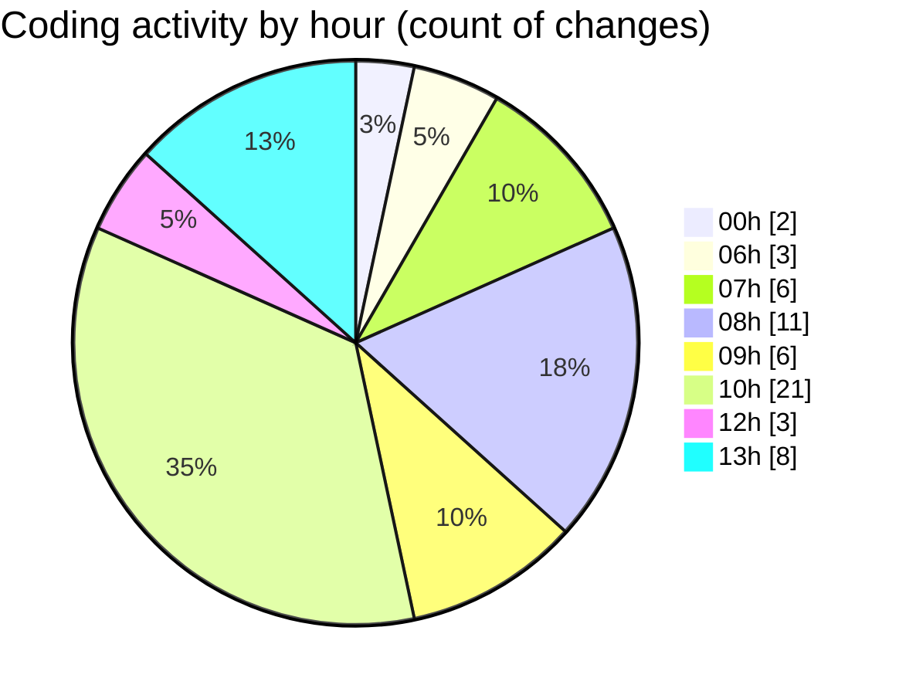

# niten - Activity Summary 

## Overall Statistics

| Stat                   | Value                                                             |
| ---------------------- | ----------------------------------------------------------------- |
| **Lines Added** (➕)   | 2320                                          |
| **Lines Removed** (➖) | 158                                        |
| **Net Change** (↕)    | 2162                |
| **Active Time** (⌚)   | 68 minutes |

## Modified Files
- **Dockerfile** (+84, -0)
- **page.tsx** (+53, -30)
- **page.tsx** (+474, -15)
- **page.tsx** (+108, -1)
- **tsconfig.json** (+128, -34)
- **package.json** (+104, -0)
- **postcss.config.mjs** (+14, -0)
- **tailwind.config.ts** (+22, -0)
- **globals.css** (+255, -10)
- **CountUp.tsx** (+114, -0)
- **StatsSection.tsx** (+39, -0)
- **globals.css** (+123, -9)
- **Testimonials.tsx** (+54, -0)
- **TestimonialsAnimation.tsx** (+174, -0)
- **next.config.ts** (+33, -3)
- **next.config.ts** (+28, -15)
- **page.tsx** (+262, -6)
- **JobDetails.tsx** (+251, -35)

## Visualizations

### By File Type (Lines Changed)

### By Hour (Estimated Activity Count)

> **Last Updated:** 5/15/2025, 1:18:31 PM