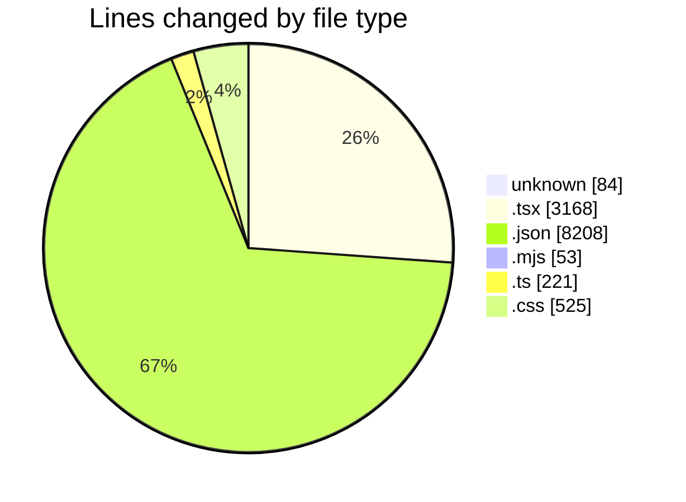
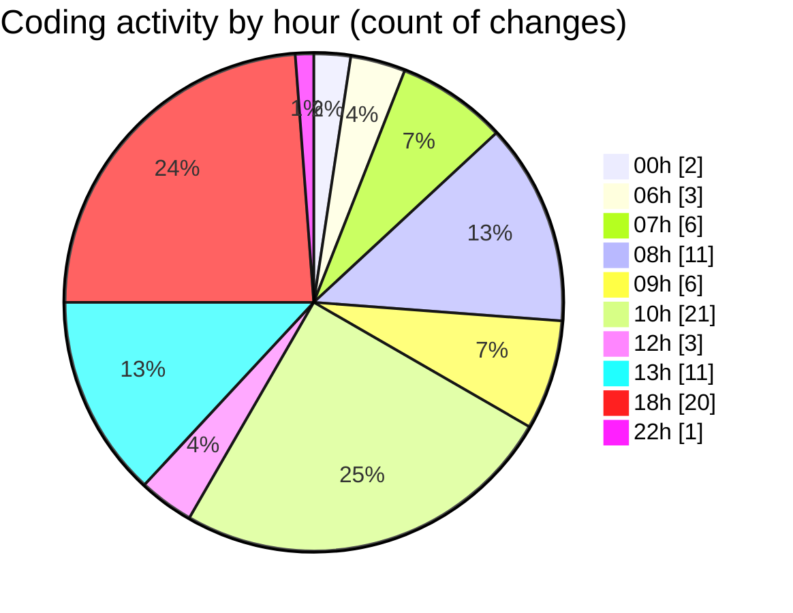

# niten - Activity Summary 

## Overall Statistics

| Stat                   | Value                                                             |
| ---------------------- | ----------------------------------------------------------------- |
| **Lines Added** (➕)   | 12098                                          |
| **Lines Removed** (➖) | 161                                        |
| **Net Change** (↕)    | 11937                |
| **Active Time** (⌚)   | 73 minutes |

## Modified Files
- **Dockerfile** (+84, -0)
- **page.tsx** (+75, -33)
- **page.tsx** (+710, -15)
- **page.tsx** (+323, -1)
- **tsconfig.json** (+128, -34)
- **package.json** (+167, -0)
- **postcss.config.mjs** (+21, -0)
- **tailwind.config.ts** (+22, -0)
- **globals.css** (+383, -10)
- **CountUp.tsx** (+228, -0)
- **StatsSection.tsx** (+78, -0)
- **globals.css** (+123, -9)
- **Testimonials.tsx** (+108, -0)
- **TestimonialsAnimation.tsx** (+348, -0)
- **next.config.ts** (+61, -3)
- **next.config.ts** (+28, -15)
- **page.tsx** (+524, -6)
- **JobDetails.tsx** (+502, -35)
- **ApplicationForm.tsx** (+182, -0)
- **page.ts** (+85, -0)
- **package.json** (+3, -0)
- **components.json** (+22, -0)
- **utils.ts** (+7, -0)
- **eslint.config.mjs** (+32, -0)
- **package-lock.json** (+7854, -0)

## Visualizations

### By File Type (Lines Changed)

### By Hour (Estimated Activity Count)

> **Last Updated:** 5/15/2025, 10:10:22 PM