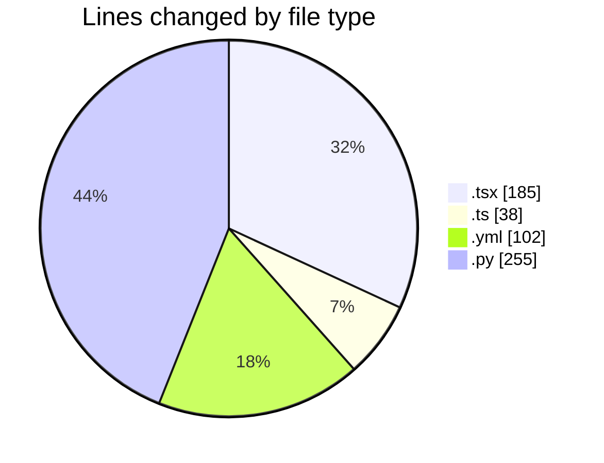
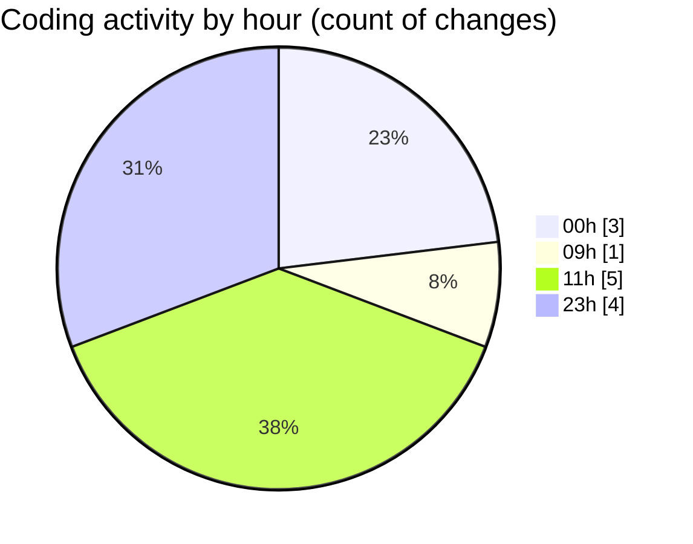

# niten - Activity Summary 

## Overall Statistics

| Stat                   | Value                                                             |
| ---------------------- | ----------------------------------------------------------------- |
| **Lines Added** (➕)   | 560                                          |
| **Lines Removed** (➖) | 20                                        |
| **Net Change** (↕)    | 540                |
| **Active Time** (⌚)   | 21 minutes |

## Modified Files
- **ServicePageContent.tsx** (+59, -19)
- **page.tsx** (+106, -1)
- **mockServices.ts** (+38, -0)
- **docker-compose.yml** (+102, -0)
- **email_exceptions.py** (+31, -0)
- **email_service.py** (+125, -0)
- **templating.py** (+99, -0)

## Visualizations

### By File Type (Lines Changed)

### By Hour (Estimated Activity Count)

> **Last Updated:** 5/16/2025, 11:44:03 AM