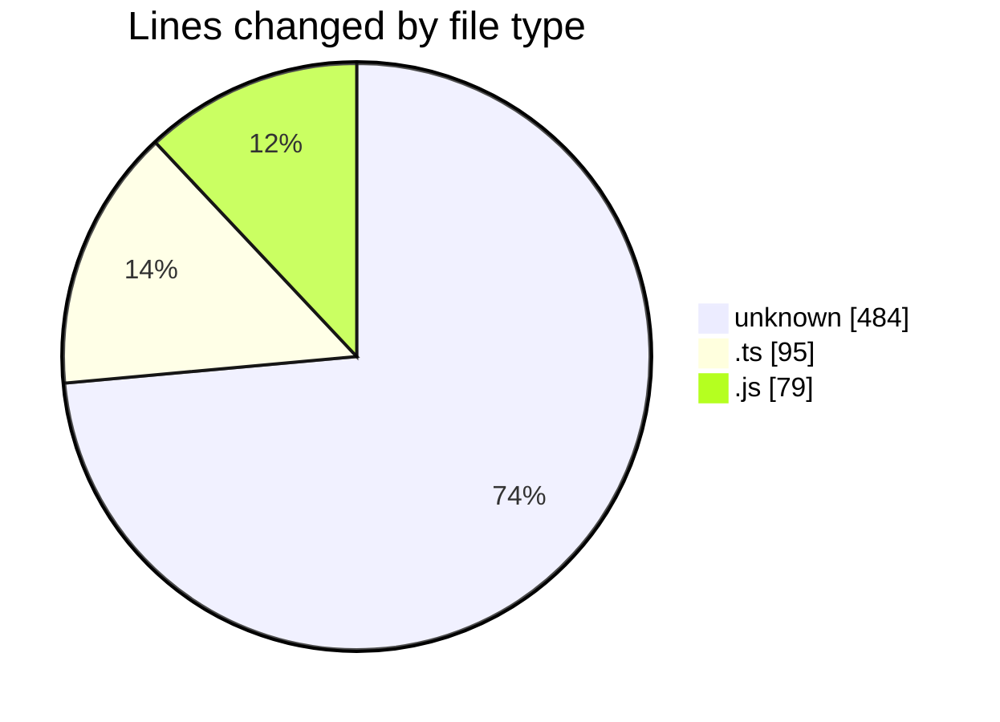
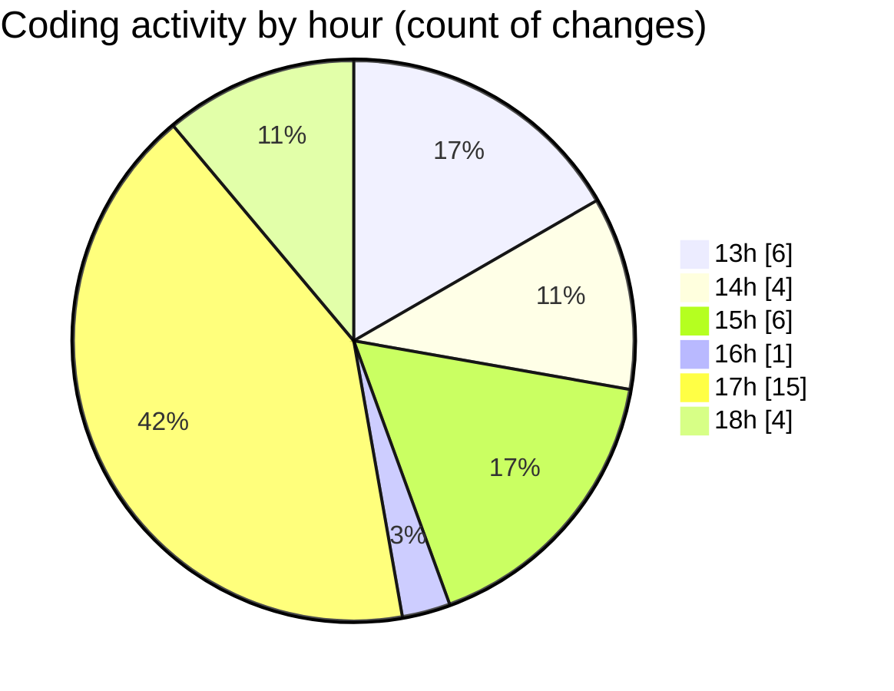

# niten - Activity Summary 

## Overall Statistics

| Stat                   | Value                                                             |
| ---------------------- | ----------------------------------------------------------------- |
| **Lines Added** (➕)   | 511                                          |
| **Lines Removed** (➖) | 147                                        |
| **Net Change** (↕)    | 364                |
| **Active Time** (⌚)   | 35 minutes |

## Modified Files
- **Dockerfile** (+312, -120)
- **next.config.ts** (+93, -2)
- **.dockerignore** (+8, -0)
- **next.config.js** (+54, -25)
- **.env** (+44, -0)

## Visualizations

### By File Type (Lines Changed)

### By Hour (Estimated Activity Count)

> **Last Updated:** 5/17/2025, 6:18:29 PM