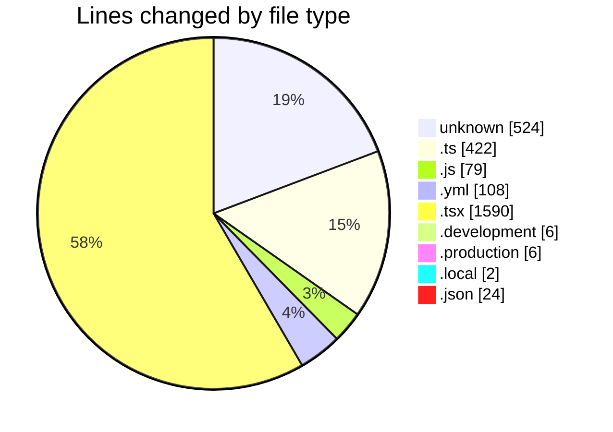
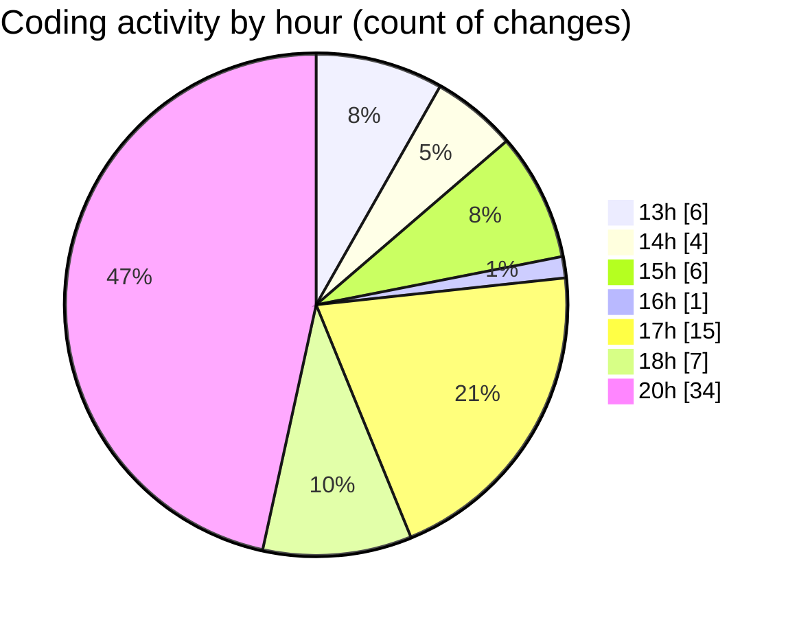

# niten - Activity Summary 

## Overall Statistics

| Stat                   | Value                                                             |
| ---------------------- | ----------------------------------------------------------------- |
| **Lines Added** (➕)   | 2419                                          |
| **Lines Removed** (➖) | 342                                        |
| **Net Change** (↕)    | 2077                |
| **Active Time** (⌚)   | 75 minutes |

## Modified Files
- **Dockerfile** (+312, -157)
- **next.config.ts** (+93, -2)
- **.dockerignore** (+8, -0)
- **next.config.js** (+54, -25)
- **.env** (+44, -0)
- **docker-compose.yml** (+102, -6)
- **api-client.ts** (+119, -0)
- **mockJobs.ts** (+110, -22)
- **page.tsx** (+229, -6)
- **page.tsx** (+306, -50)
- **page.tsx** (+182, -53)
- **ApplicationForm.tsx** (+202, -20)
- **.env.development** (+6, -0)
- **.env.production** (+6, -0)
- **.env** (+2, -1)
- **.env.local** (+2, -0)
- **page.tsx** (+10, -0)
- **Start.tsx** (+164, -0)
- **page.tsx** (+68, -0)
- **Navbar.tsx** (+195, -0)
- **ServiceHero.tsx** (+105, -0)
- **routing.ts** (+43, -0)
- **navigation.json** (+12, -0)
- **navigation.json** (+12, -0)
- **request.ts** (+33, -0)

## Visualizations

### By File Type (Lines Changed)

### By Hour (Estimated Activity Count)

> **Last Updated:** 5/17/2025, 8:48:09 PM