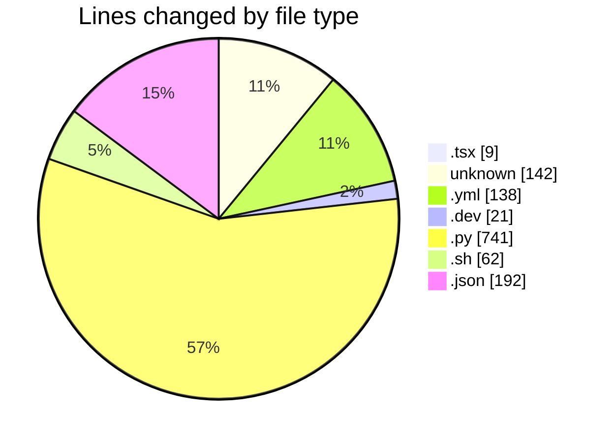
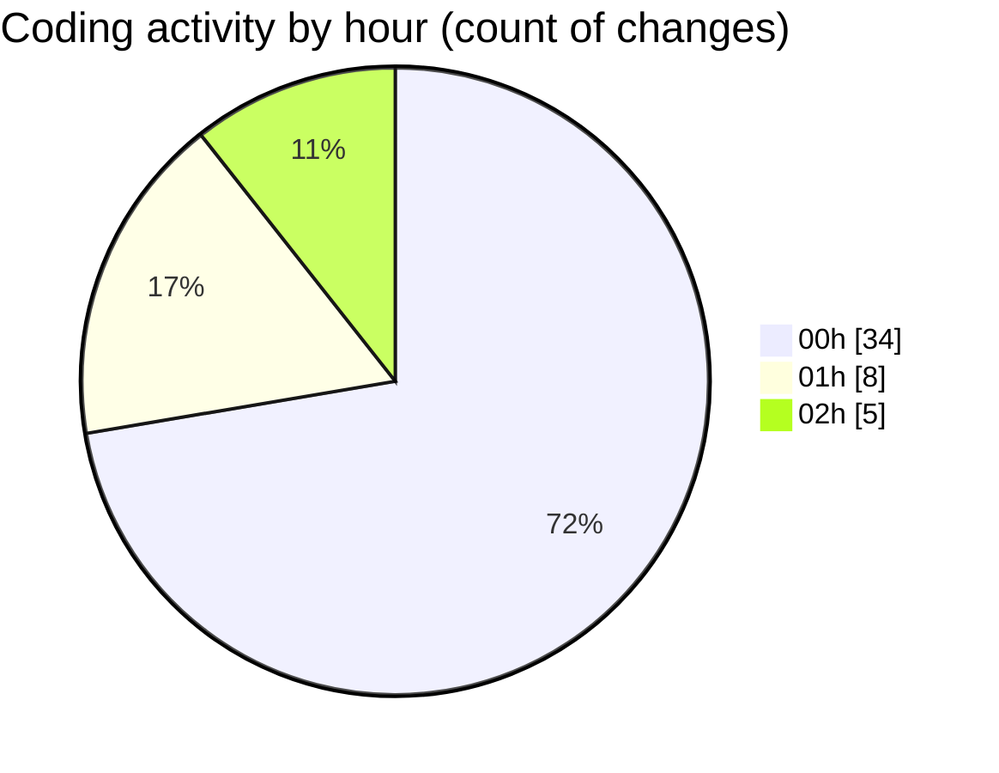

# niten - Activity Summary 

## Overall Statistics

| Stat                   | Value                                                             |
| ---------------------- | ----------------------------------------------------------------- |
| **Lines Added** (➕)   | 1011                                          |
| **Lines Removed** (➖) | 294                                        |
| **Net Change** (↕)    | 717                |
| **Active Time** (⌚)   | 66 minutes |

## Modified Files
- **JobList.tsx** (+1, -1)
- **Dockerfile** (+54, -10)
- **docker-compose.yml** (+120, -18)
- **Dockerfile.dev** (+21, -0)
- **main.py** (+71, -30)
- **jobs.py** (+407, -225)
- **.env** (+44, -0)
- **entrypoint.sh** (+52, -10)
- **COMMIT_EDITMSG** (+34, -0)
- **careers.json** (+96, -0)
- **careers.json** (+96, -0)
- **router.py** (+8, -0)
- **page.tsx** (+7, -0)

## Visualizations

### By File Type (Lines Changed)

### By Hour (Estimated Activity Count)

> **Last Updated:** 5/18/2025, 2:16:55 AM