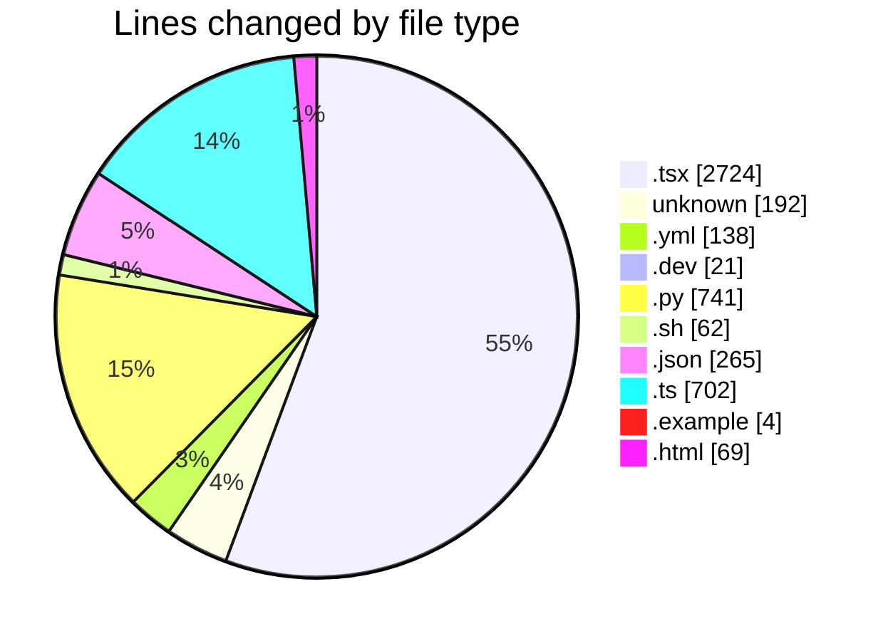
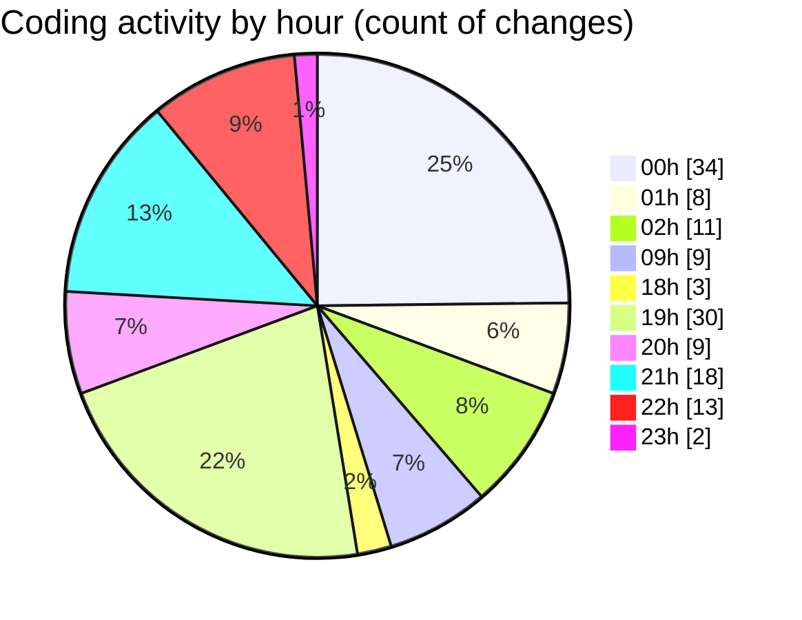

# niten - Activity Summary 

## Overall Statistics

| Stat                   | Value                                                             |
| ---------------------- | ----------------------------------------------------------------- |
| **Lines Added** (➕)   | 4070                                          |
| **Lines Removed** (➖) | 848                                        |
| **Net Change** (↕)    | 3222                |
| **Active Time** (⌚)   | 187 minutes |

## Modified Files
- **JobList.tsx** (+138, -6)
- **Dockerfile** (+54, -10)
- **docker-compose.yml** (+120, -18)
- **Dockerfile.dev** (+21, -0)
- **main.py** (+71, -30)
- **jobs.py** (+407, -225)
- **.env** (+88, -0)
- **entrypoint.sh** (+52, -10)
- **COMMIT_EDITMSG** (+34, -0)
- **careers.json** (+96, -0)
- **careers.json** (+96, -0)
- **router.py** (+8, -0)
- **page.tsx** (+194, -78)
- **FeaturedJobs.tsx** (+325, -60)
- **page.tsx** (+452, -0)
- **package.json** (+3, -0)
- **Badge.tsx** (+37, -0)
- **skeleton.tsx** (+16, -0)
- **page.tsx** (+230, -54)
- **Navbar.tsx** (+197, -1)
- **Start.tsx** (+165, -164)
- **page.tsx** (+191, -25)
- **start.json** (+35, -0)
- **start.json** (+35, -0)
- **page.tsx** (+165, -0)
- **page.ts** (+85, -0)
- **ContactForm.tsx** (+220, -6)
- **api-client.ts** (+165, -83)
- **.env.example** (+4, -0)
- **route.ts** (+76, -9)
- **email.ts** (+75, -36)
- **application_confirmation.html** (+69, -0)
- **.env** (+6, -0)
- **route.ts** (+77, -33)
- **route.ts** (+42, -0)
- **route.ts** (+21, -0)

## Visualizations

### By File Type (Lines Changed)

### By Hour (Estimated Activity Count)

> **Last Updated:** 5/18/2025, 11:08:03 PM