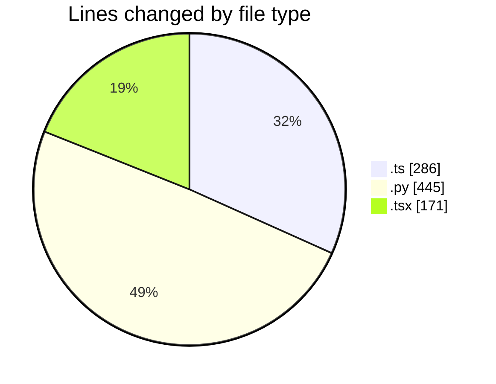
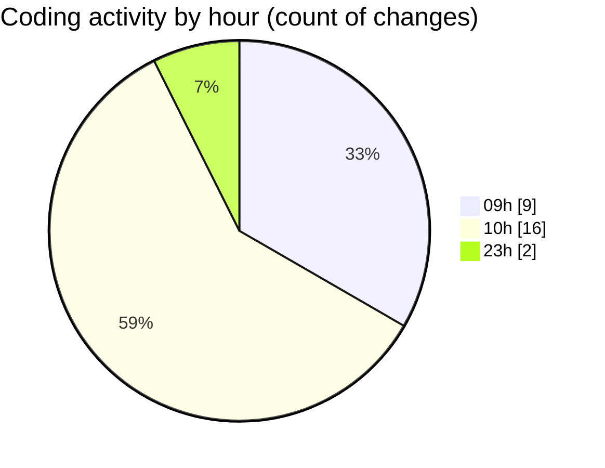

# niten - Activity Summary 

## Overall Statistics

| Stat                   | Value                                                             |
| ---------------------- | ----------------------------------------------------------------- |
| **Lines Added** (➕)   | 836                                          |
| **Lines Removed** (➖) | 66                                        |
| **Net Change** (↕)    | 770                |
| **Active Time** (⌚)   | 43 minutes |

## Modified Files
- **route.ts** (+105, -33)
- **storage_service.py** (+53, -11)
- **jobs.py** (+198, -16)
- **careers.py** (+100, -1)
- **careers.py** (+66, -0)
- **route.ts** (+48, -0)
- **api-client.ts** (+100, -0)
- **page.tsx** (+166, -5)

## Visualizations

### By File Type (Lines Changed)

### By Hour (Estimated Activity Count)

> **Last Updated:** 5/19/2025, 10:23:15 AM