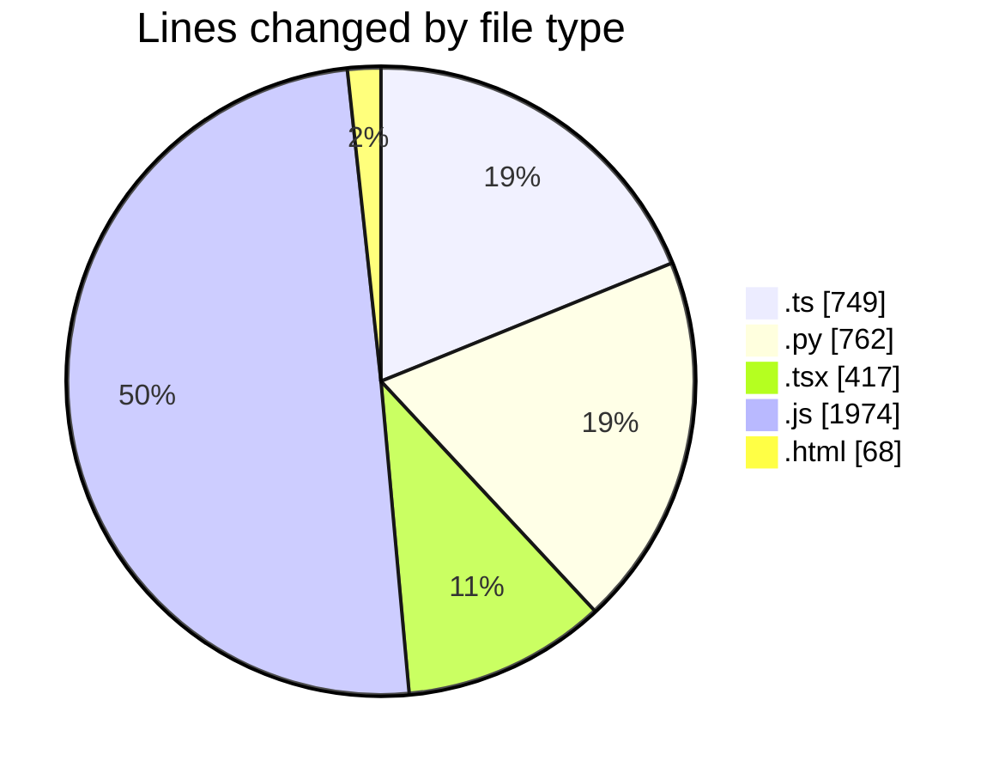
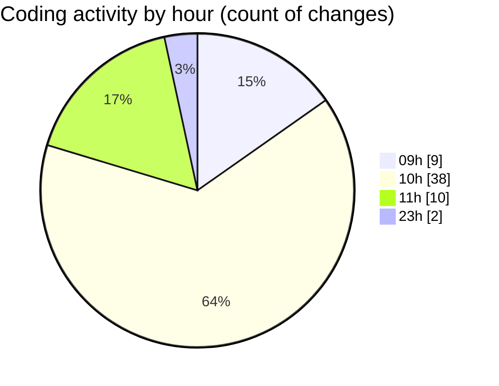

# niten - Activity Summary 

## Overall Statistics

| Stat                   | Value                                                             |
| ---------------------- | ----------------------------------------------------------------- |
| **Lines Added** (➕)   | 3755                                          |
| **Lines Removed** (➖) | 215                                        |
| **Net Change** (↕)    | 3540                |
| **Active Time** (⌚)   | 97 minutes |

## Modified Files
- **route.ts** (+146, -99)
- **storage_service.py** (+53, -11)
- **jobs.py** (+198, -16)
- **careers.py** (+100, -1)
- **careers.py** (+66, -0)
- **route.ts** (+71, -23)
- **api-client.ts** (+116, -34)
- **page.tsx** (+169, -5)
- **_5de586a6._.js** (+1249, -0)
- **_e26fae4a._.js** (+725, -0)
- **ApplicationForm.tsx** (+217, -26)
- **route.ts** (+68, -0)
- **email.ts** (+84, -0)
- **meeting_confirmation.html** (+68, -0)
- **templating.py** (+130, -0)
- **email_service.py** (+159, -0)
- **email.py** (+28, -0)
- **route.ts** (+54, -0)
- **route.ts** (+54, -0)

## Visualizations

### By File Type (Lines Changed)

### By Hour (Estimated Activity Count)

> **Last Updated:** 5/19/2025, 11:13:17 AM