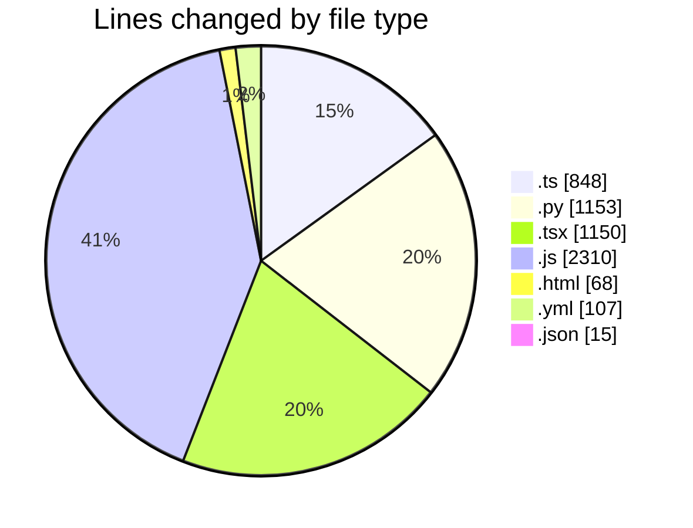
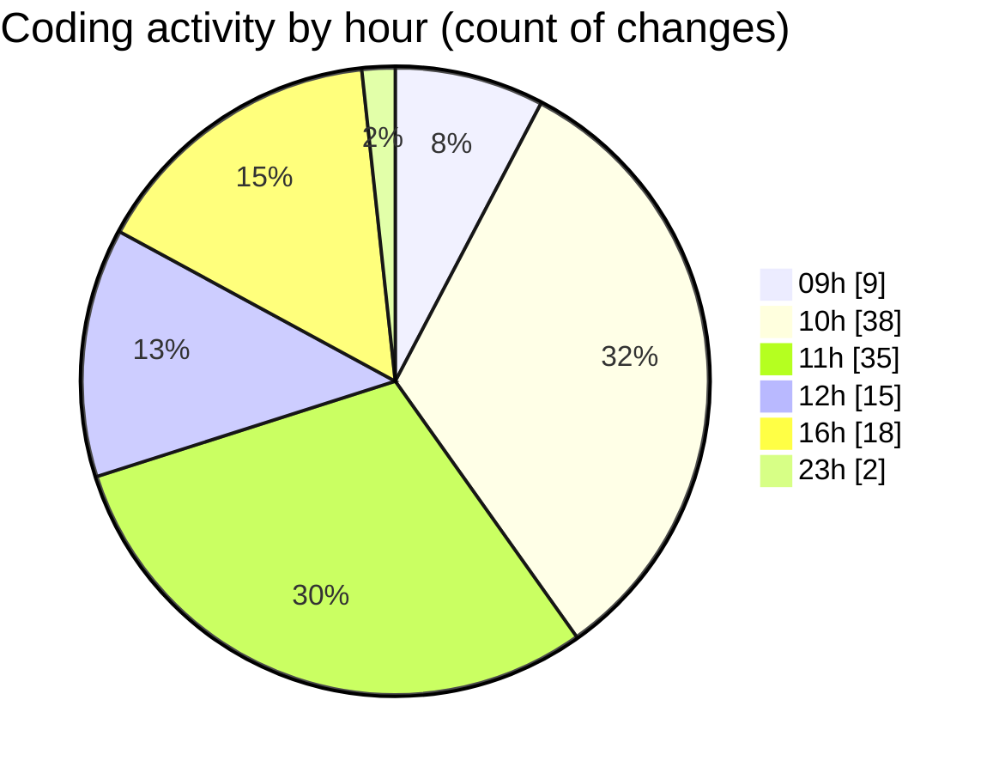

# niten - Activity Summary 

## Overall Statistics

| Stat                   | Value                                                             |
| ---------------------- | ----------------------------------------------------------------- |
| **Lines Added** (➕)   | 5287                                          |
| **Lines Removed** (➖) | 364                                        |
| **Net Change** (↕)    | 4923                |
| **Active Time** (⌚)   | 215 minutes |

## Modified Files
- **route.ts** (+146, -99)
- **storage_service.py** (+53, -11)
- **jobs.py** (+211, -22)
- **careers.py** (+128, -29)
- **careers.py** (+131, -65)
- **route.ts** (+71, -23)
- **api-client.ts** (+116, -34)
- **page.tsx** (+169, -5)
- **_5de586a6._.js** (+1249, -0)
- **_e26fae4a._.js** (+725, -0)
- **ApplicationForm.tsx** (+253, -51)
- **route.ts** (+68, -0)
- **email.ts** (+84, -0)
- **meeting_confirmation.html** (+68, -0)
- **templating.py** (+130, -0)
- **email_service.py** (+159, -0)
- **email.py** (+28, -0)
- **route.ts** (+54, -0)
- **route.ts** (+65, -10)
- **config.py** (+104, -4)
- **docker-compose.yml** (+107, -0)
- **FeaturedJobs.tsx** (+139, -0)
- **application_service.py** (+76, -2)
- **page.tsx** (+226, -0)
- **page.tsx** (+179, -0)
- **Features.tsx** (+86, -4)
- **middleware.ts** (+26, -3)
- **routing.ts** (+48, -1)
- **[root-of-the-server]__51ce87c9._.js** (+336, -0)
- **app-paths-manifest.json** (+15, -0)
- **page.tsx** (+37, -1)

## Visualizations

### By File Type (Lines Changed)

### By Hour (Estimated Activity Count)

> **Last Updated:** 5/19/2025, 4:43:03 PM