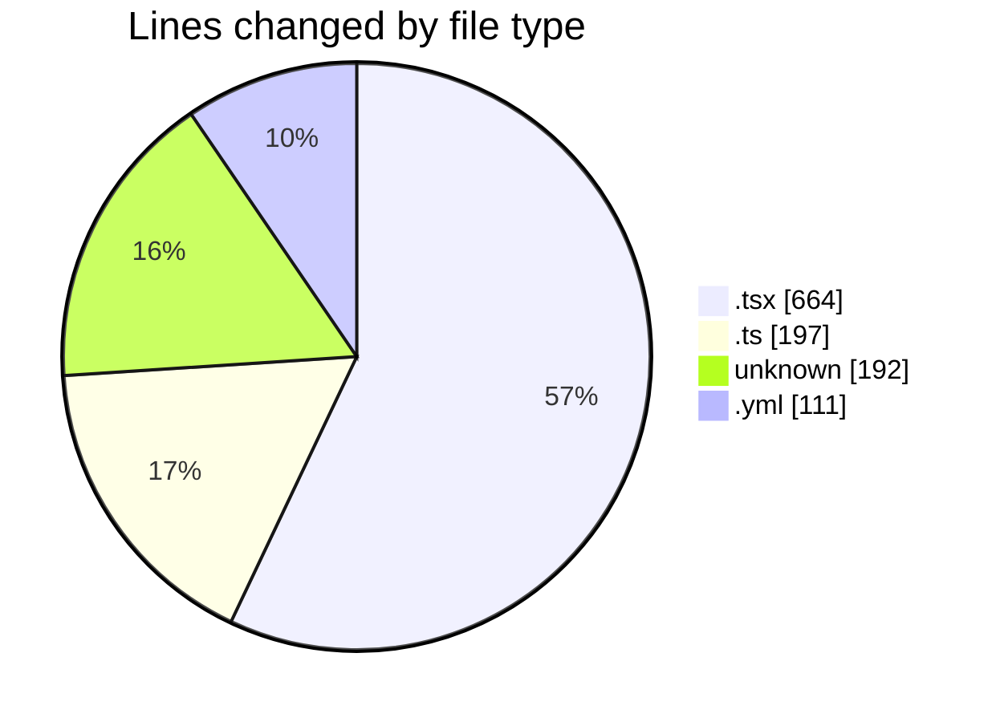
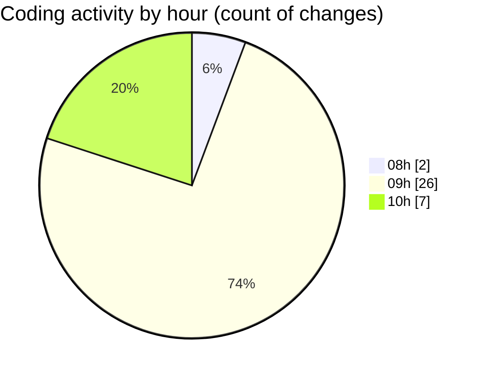

# niten - Activity Summary 

## Overall Statistics

| Stat                   | Value                                                             |
| ---------------------- | ----------------------------------------------------------------- |
| **Lines Added** (➕)   | 1098                                          |
| **Lines Removed** (➖) | 66                                        |
| **Net Change** (↕)    | 1032                |
| **Active Time** (⌚)   | 49 minutes |

## Modified Files
- **Navbar.tsx** (+221, -12)
- **layout.tsx** (+64, -0)
- **api-client.ts** (+85, -0)
- **FeaturedJobs.tsx** (+139, -1)
- **page.tsx** (+226, -1)
- **route.ts** (+50, -4)
- **.env** (+49, -0)
- **Dockerfile** (+91, -46)
- **docker-compose.yml** (+109, -2)
- **.env** (+6, -0)
- **route.ts** (+58, -0)

## Visualizations

### By File Type (Lines Changed)

### By Hour (Estimated Activity Count)

> **Last Updated:** 5/20/2025, 10:11:42 AM