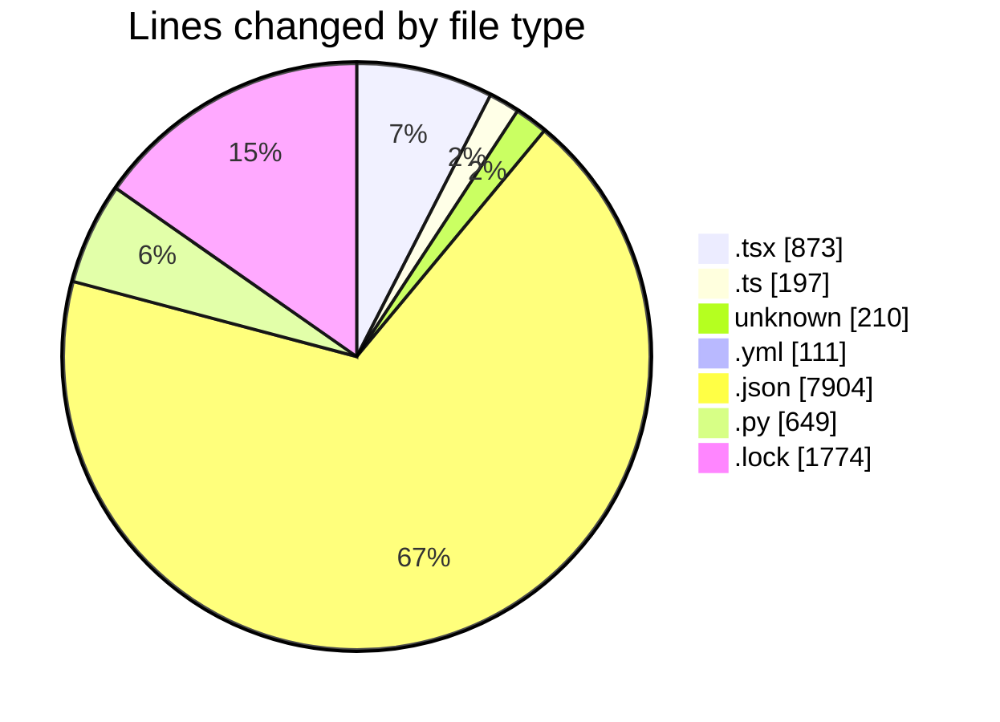
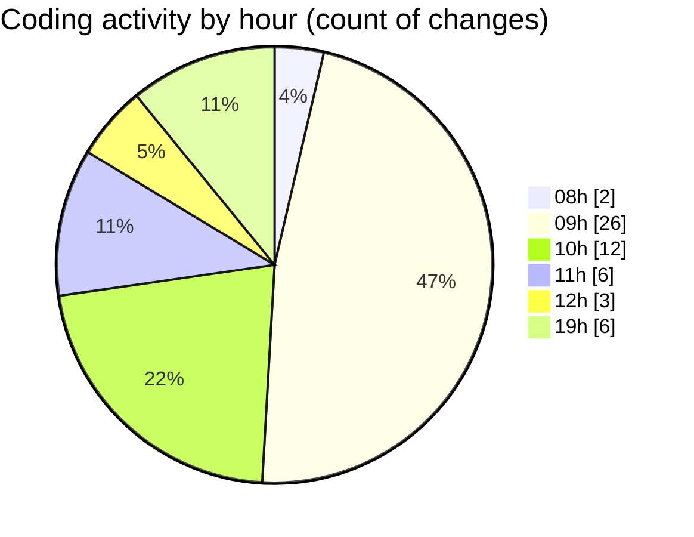

# niten - Activity Summary 

## Overall Statistics

| Stat                   | Value                                                             |
| ---------------------- | ----------------------------------------------------------------- |
| **Lines Added** (➕)   | 11496                                          |
| **Lines Removed** (➖) | 222                                        |
| **Net Change** (↕)    | 11274                |
| **Active Time** (⌚)   | 70 minutes |

## Modified Files
- **Navbar.tsx** (+430, -12)
- **layout.tsx** (+64, -0)
- **api-client.ts** (+85, -0)
- **FeaturedJobs.tsx** (+139, -1)
- **page.tsx** (+226, -1)
- **route.ts** (+50, -4)
- **.env** (+49, -0)
- **Dockerfile** (+91, -46)
- **docker-compose.yml** (+109, -2)
- **.env** (+6, -0)
- **route.ts** (+58, -0)
- **package-lock.json** (+7904, -0)
- **.dockerignore** (+8, -1)
- **.dockerignore** (+8, -1)
- **storage_service.py** (+48, -1)
- **application_service.py** (+74, -2)
- **careers.py** (+64, -0)
- **careers.py** (+99, -1)
- **email_service.py** (+159, -95)
- **config.py** (+100, -6)
- **poetry.lock** (+1725, -49)

## Visualizations

### By File Type (Lines Changed)

### By Hour (Estimated Activity Count)

> **Last Updated:** 5/20/2025, 7:14:27 PM