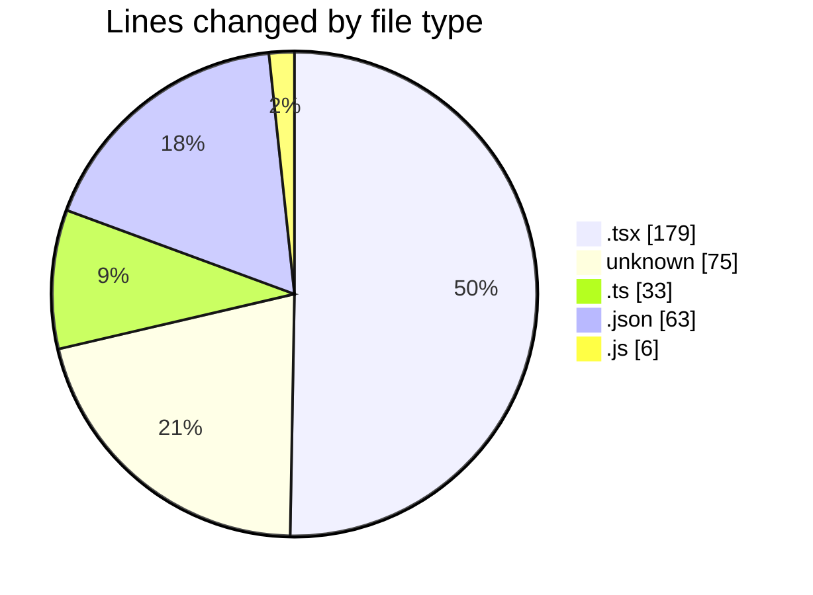
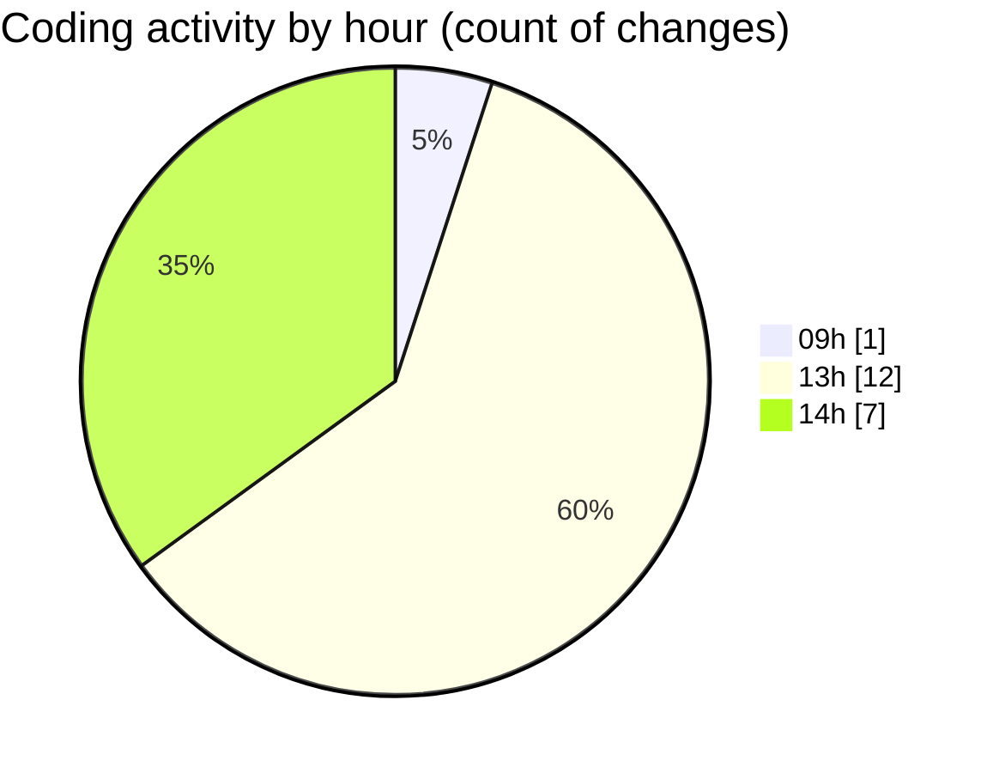

# niten - Activity Summary 

## Overall Statistics

| Stat                   | Value                                                             |
| ---------------------- | ----------------------------------------------------------------- |
| **Lines Added** (➕)   | 349                                          |
| **Lines Removed** (➖) | 7                                        |
| **Net Change** (↕)    | 342                |
| **Active Time** (⌚)   | 31 minutes |

## Modified Files
- **page.tsx** (+179, -0)
- **pre-commit** (+10, -4)
- **commit-msg** (+1, -0)
- **.huskyrc** (+6, -0)
- **.eslintignore** (+9, -0)
- **.npmignore** (+45, -0)
- **next.config.ts** (+30, -3)
- **package.json** (+50, -0)
- **.eslintrc.json** (+13, -0)
- **prettier.config.js** (+6, -0)

## Visualizations

### By File Type (Lines Changed)

### By Hour (Estimated Activity Count)

> **Last Updated:** 5/21/2025, 2:10:27 PM