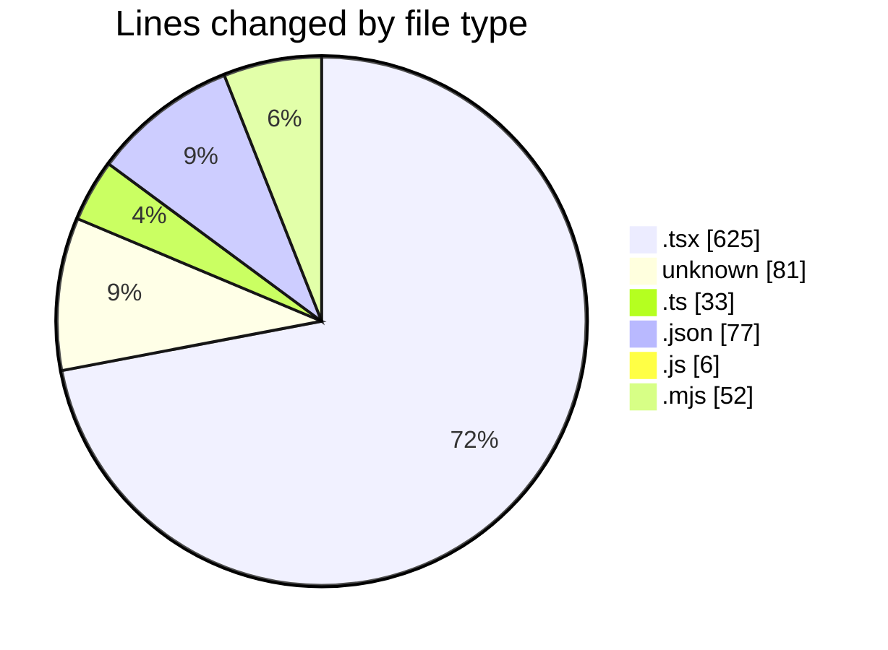
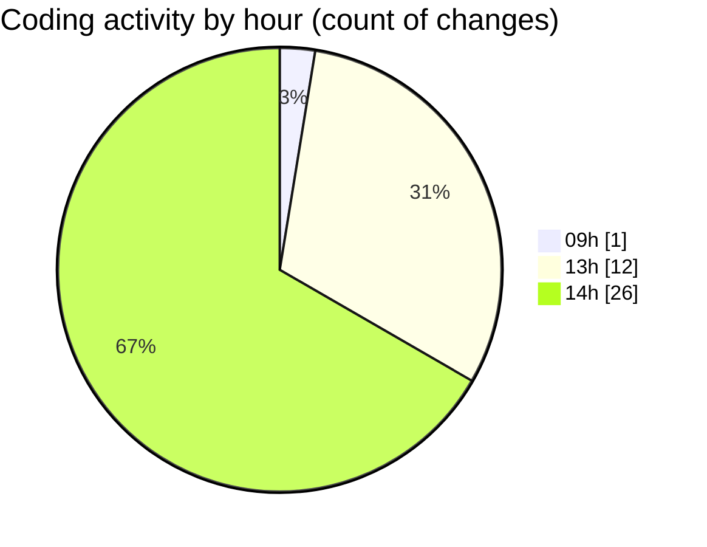

# niten - Activity Summary 

## Overall Statistics

| Stat                   | Value                                                             |
| ---------------------- | ----------------------------------------------------------------- |
| **Lines Added** (➕)   | 831                                          |
| **Lines Removed** (➖) | 43                                        |
| **Net Change** (↕)    | 788                |
| **Active Time** (⌚)   | 56 minutes |

## Modified Files
- **page.tsx** (+179, -0)
- **pre-commit** (+10, -4)
- **commit-msg** (+1, -0)
- **.huskyrc** (+6, -0)
- **.eslintignore** (+10, -5)
- **.npmignore** (+45, -0)
- **next.config.ts** (+30, -3)
- **package.json** (+60, -0)
- **.eslintrc.json** (+17, -0)
- **prettier.config.js** (+6, -0)
- **eslint.config.mjs** (+32, -20)
- **ProjectCard.tsx** (+117, -1)
- **Navbar.tsx** (+209, -2)
- **MapComponent.tsx** (+49, -0)
- **HeroSection.tsx** (+60, -8)

## Visualizations

### By File Type (Lines Changed)

### By Hour (Estimated Activity Count)

> **Last Updated:** 5/21/2025, 2:40:27 PM