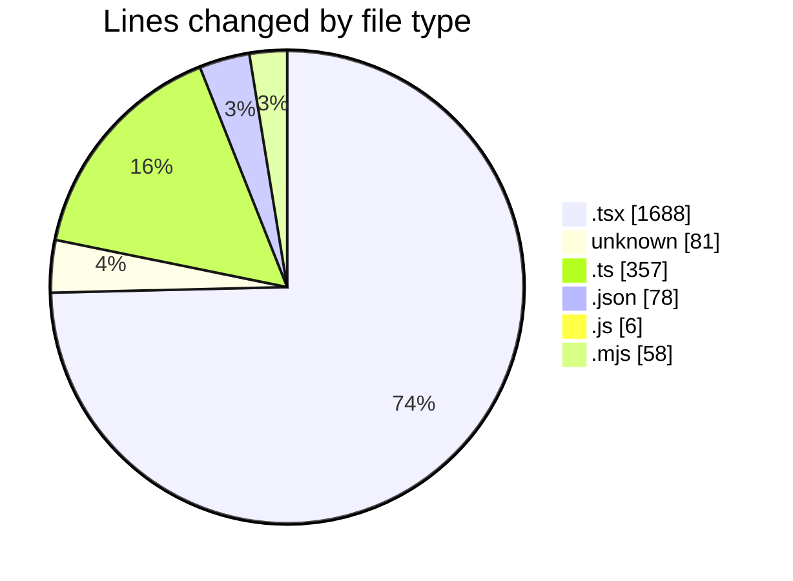
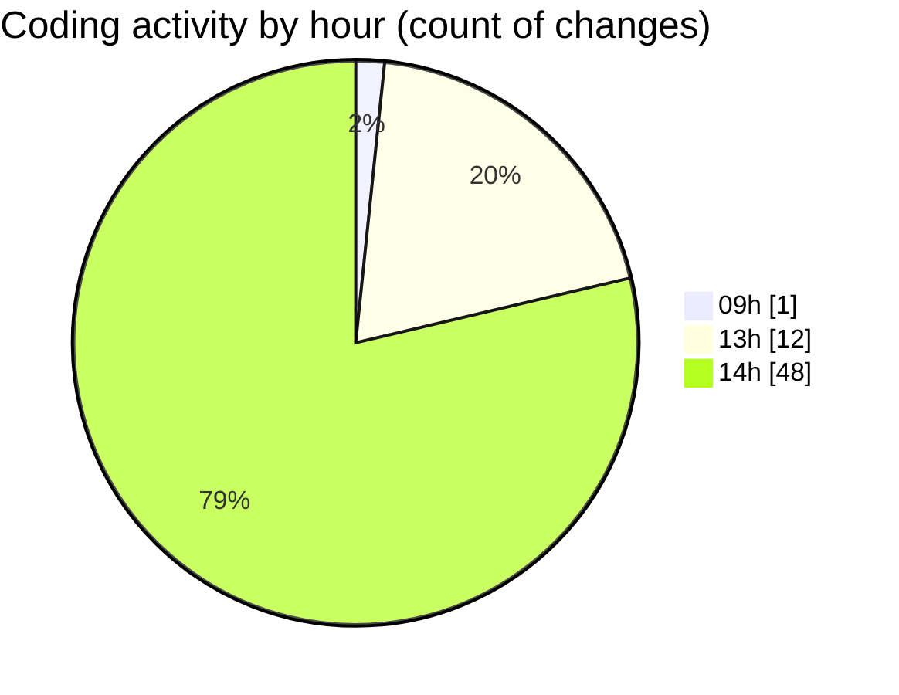

# niten - Activity Summary 

## Overall Statistics

| Stat                   | Value                                                             |
| ---------------------- | ----------------------------------------------------------------- |
| **Lines Added** (➕)   | 2219                                          |
| **Lines Removed** (➖) | 49                                        |
| **Net Change** (↕)    | 2170                |
| **Active Time** (⌚)   | 95 minutes |

## Modified Files
- **page.tsx** (+179, -0)
- **pre-commit** (+10, -4)
- **commit-msg** (+1, -0)
- **.huskyrc** (+6, -0)
- **.eslintignore** (+10, -5)
- **.npmignore** (+45, -0)
- **next.config.ts** (+30, -3)
- **package.json** (+60, -0)
- **.eslintrc.json** (+18, -0)
- **prettier.config.js** (+6, -0)
- **eslint.config.mjs** (+38, -20)
- **ProjectCard.tsx** (+117, -1)
- **Navbar.tsx** (+213, -2)
- **MapComponent.tsx** (+49, -0)
- **HeroSection.tsx** (+60, -9)
- **page.tsx** (+178, -1)
- **page.tsx** (+108, -3)
- **Switcher.tsx** (+137, -1)
- **page.tsx** (+234, -0)
- **page.tsx** (+21, -0)
- **page.tsx** (+37, -0)
- **route.ts** (+44, -0)
- **FeaturedJobs.tsx** (+134, -0)
- **skeleton.tsx** (+16, -0)
- **api-client.ts** (+89, -0)
- **email.ts** (+191, -0)
- **page.tsx** (+188, -0)

## Visualizations

### By File Type (Lines Changed)

### By Hour (Estimated Activity Count)

> **Last Updated:** 5/21/2025, 3:00:27 PM