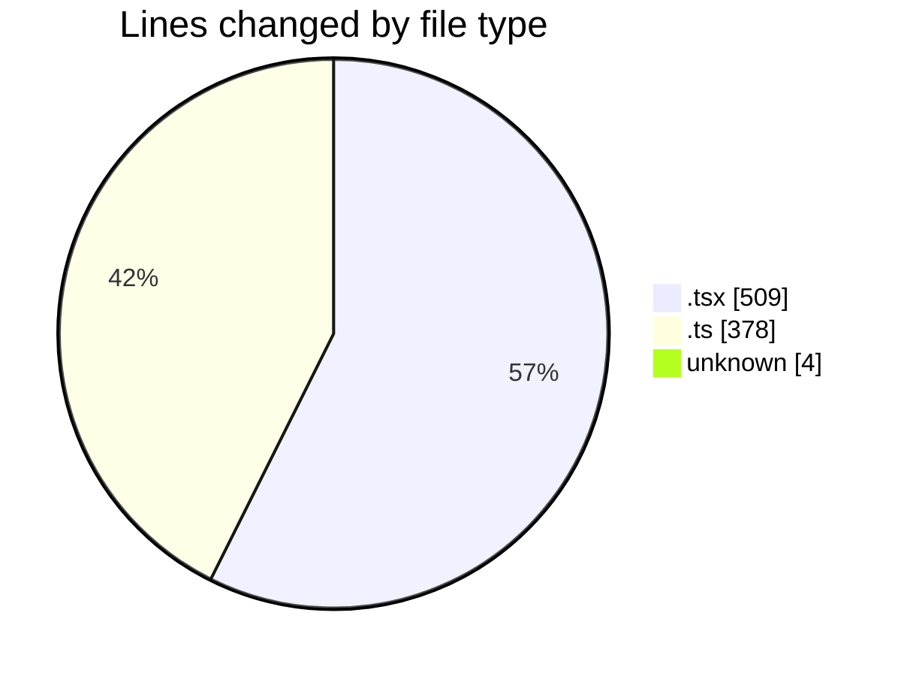
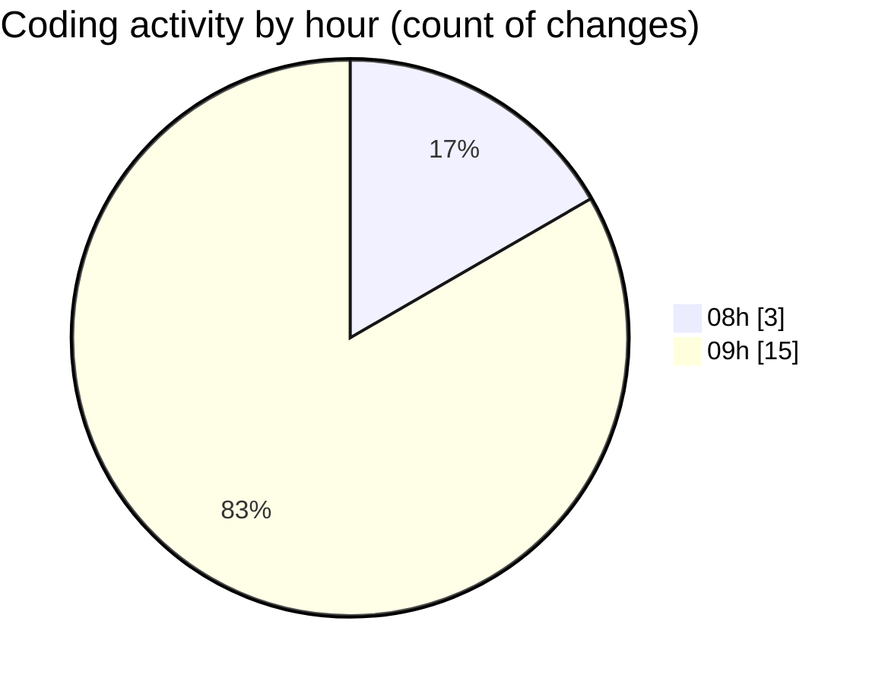

# niten - Activity Summary 

## Overall Statistics

| Stat                   | Value                                                             |
| ---------------------- | ----------------------------------------------------------------- |
| **Lines Added** (➕)   | 880                                          |
| **Lines Removed** (➖) | 11                                        |
| **Net Change** (↕)    | 869                |
| **Active Time** (⌚)   | 22 minutes |

## Modified Files
- **page.tsx** (+234, -0)
- **route.ts** (+44, -0)
- **FeaturedJobs.tsx** (+134, -0)
- **next.config.ts** (+30, -0)
- **pre-commit** (+2, -0)
- **pre-push** (+2, -0)
- **Switcher.tsx** (+138, -3)
- **email.ts** (+199, -0)
- **api-client.ts** (+97, -8)

## Visualizations

### By File Type (Lines Changed)

### By Hour (Estimated Activity Count)

> **Last Updated:** 5/22/2025, 10:01:17 AM