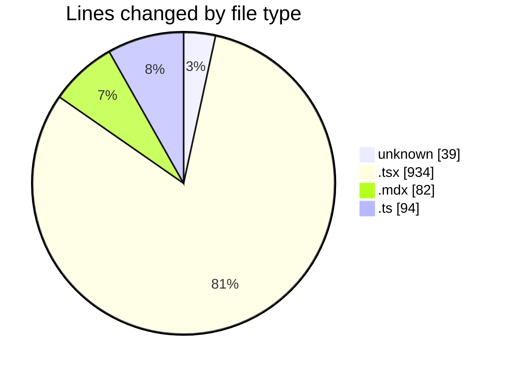
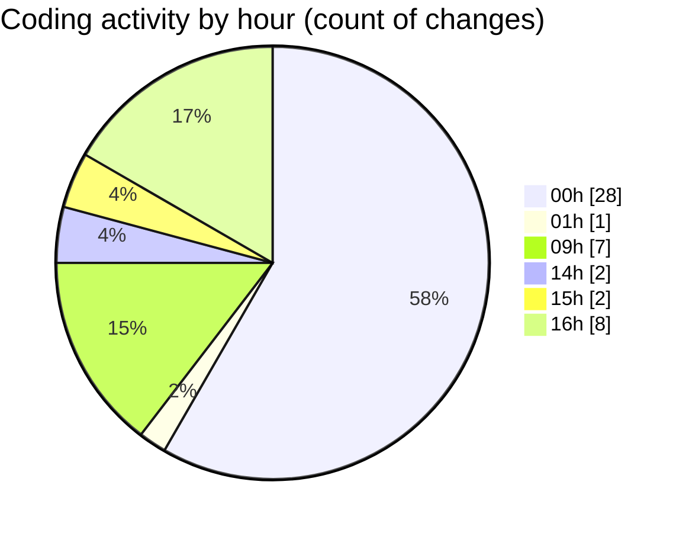

# Elitesun - Activity Summary 

## Overall Statistics

| Stat                   | Value                                                             |
| ---------------------- | ----------------------------------------------------------------- |
| **Lines Added** (➕)   | 999                                          |
| **Lines Removed** (➖) | 150                                        |
| **Net Change** (↕)    | 849                |
| **Active Time** (⌚)   | 51 minutes |

## Modified Files
- **.gitignore** (+39, -0)
- **Logo.tsx** (+135, -0)
- **SideAnimate.tsx** (+1, -0)
- **Recent-designs.mdx** (+37, -4)
- **More-Recent-designs.mdx** (+37, -4)
- **Projects.tsx** (+186, -123)
- **page.tsx** (+86, -12)
- **utils.ts** (+89, -5)
- **page.tsx** (+91, -1)
- **lolo.tsx** (+10, -1)
- **ogCard.tsx** (+124, -0)
- **ProjectCard.tsx** (+96, -0)
- **BentoGrid.tsx** (+68, -0)

## Visualizations

### By File Type (Lines Changed)

### By Hour (Estimated Activity Count)

> **Last Updated:** 5/24/2025, 4:13:51 PM