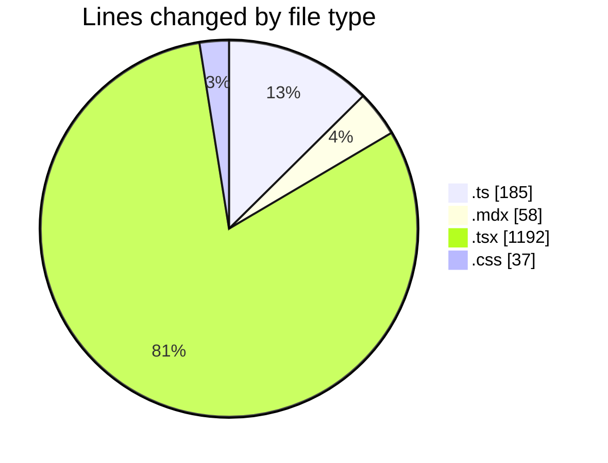
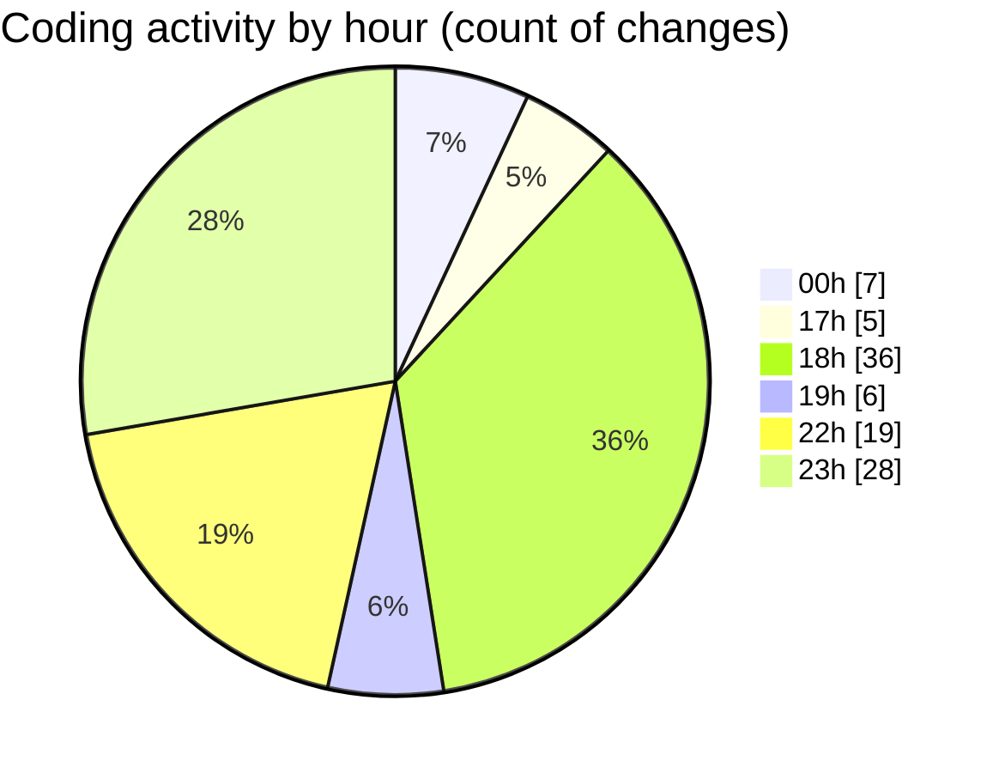

# Elitesun - Activity Summary 

## Overall Statistics

| Stat                   | Value                                                             |
| ---------------------- | ----------------------------------------------------------------- |
| **Lines Added** (➕)   | 1242                                          |
| **Lines Removed** (➖) | 230                                        |
| **Net Change** (↕)    | 1012                |
| **Active Time** (⌚)   | 142 minutes |

## Modified Files
- **utils.ts** (+92, -15)
- **More-Recent-designs.mdx** (+0, -3)
- **Recent-designs.mdx** (+17, -5)
- **Projects.tsx** (+127, -60)
- **ProjectCard.tsx** (+273, -106)
- **Small-Project.mdx** (+24, -9)
- **Carousel.tsx** (+170, -7)
- **page.tsx** (+64, -14)
- **MiniCarousel.tsx** (+140, -11)
- **index.ts** (+78, -0)
- **page.tsx** (+90, -0)
- **globals.css** (+37, -0)
- **LetterFx.tsx** (+130, -0)

## Visualizations

### By File Type (Lines Changed)

### By Hour (Estimated Activity Count)

> **Last Updated:** 5/25/2025, 11:57:38 PM