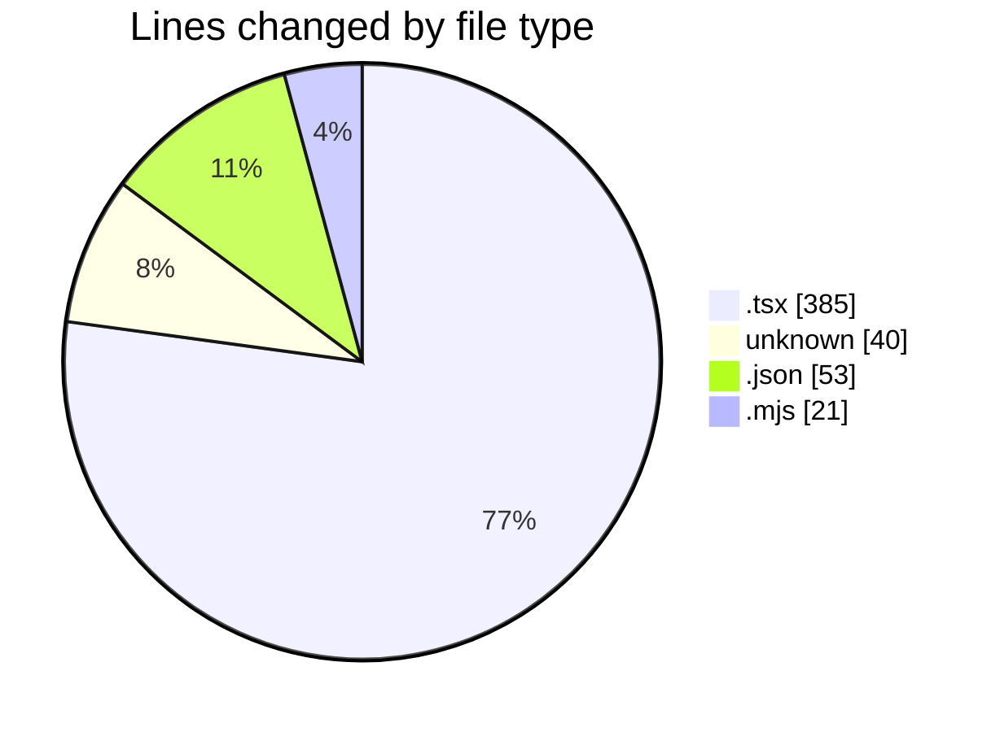
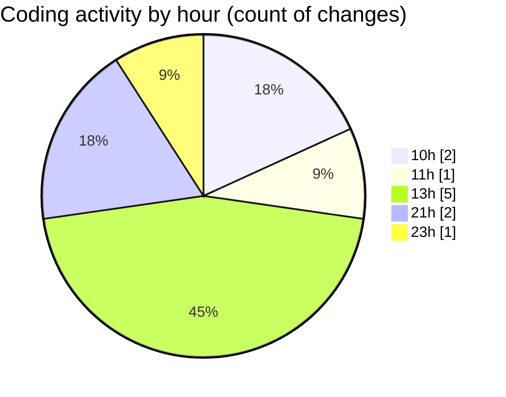

# Elitesun - Activity Summary 

## Overall Statistics

| Stat                   | Value                                                             |
| ---------------------- | ----------------------------------------------------------------- |
| **Lines Added** (➕)   | 498                                          |
| **Lines Removed** (➖) | 1                                        |
| **Net Change** (↕)    | 497                |
| **Active Time** (⌚)   | 15 minutes |

## Modified Files
- **page.tsx** (+1, -0)
- **.gitignore** (+40, -0)
- **page.tsx** (+94, -0)
- **package.json** (+53, -0)
- **next.config.mjs** (+20, -1)
- **Header.tsx** (+155, -0)
- **Logo.tsx** (+135, -0)

## Visualizations

### By File Type (Lines Changed)

### By Hour (Estimated Activity Count)

> **Last Updated:** 5/26/2025, 9:40:38 PM