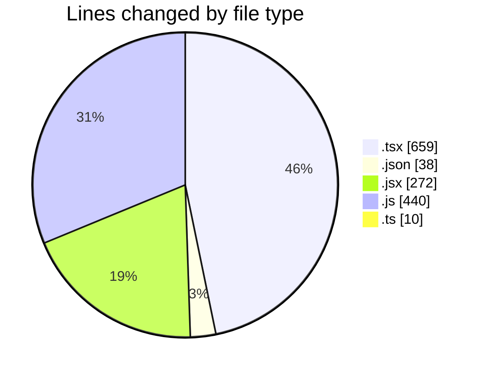
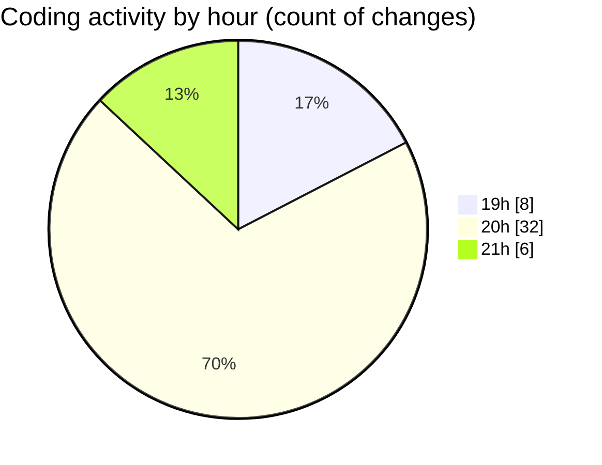

# ecom_store - Activity Summary 

## Overall Statistics

| Stat                   | Value                                                             |
| ---------------------- | ----------------------------------------------------------------- |
| **Lines Added** (➕)   | 1178                                          |
| **Lines Removed** (➖) | 241                                        |
| **Net Change** (↕)    | 937                |
| **Active Time** (⌚)   | 67 minutes |

## Modified Files
- **Sidebar.tsx** (+188, -21)
- **page.tsx** (+119, -114)
- **Nav.tsx** (+88, -56)
- **Recommended.tsx** (+19, -0)
- **Input.tsx** (+11, -0)
- **tsconfig.json** (+38, -0)
- **Navigation.tsx** (+43, -0)
- **Button.jsx** (+14, -0)
- **data.js** (+406, -25)
- **Product.jsx** (+98, -25)
- **data.ts** (+10, -0)
- **MainPage.jsx** (+79, -0)
- **next.config.js** (+9, -0)
- **Navigation.jsx** (+56, -0)

## Visualizations

### By File Type (Lines Changed)

### By Hour (Estimated Activity Count)

> **Last Updated:** 5/27/2025, 9:07:58 PM