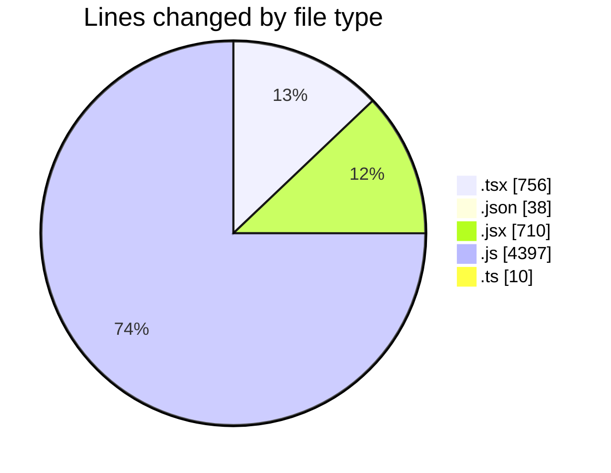
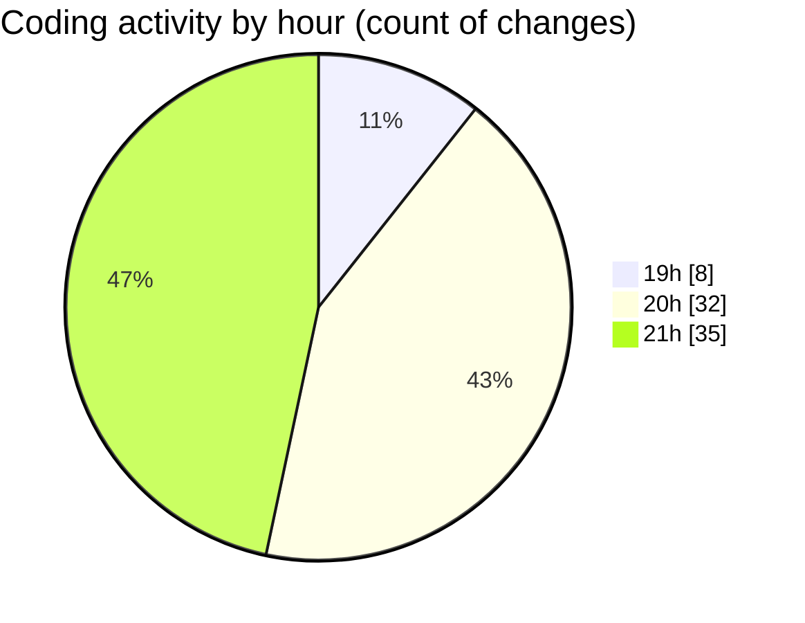

# ecom_store - Activity Summary 

## Overall Statistics

| Stat                   | Value                                                             |
| ---------------------- | ----------------------------------------------------------------- |
| **Lines Added** (➕)   | 5536                                          |
| **Lines Removed** (➖) | 375                                        |
| **Net Change** (↕)    | 5161                |
| **Active Time** (⌚)   | 111 minutes |

## Modified Files
- **Sidebar.tsx** (+188, -21)
- **page.tsx** (+119, -114)
- **Nav.tsx** (+88, -56)
- **Recommended.tsx** (+19, -0)
- **Input.tsx** (+11, -0)
- **tsconfig.json** (+38, -0)
- **Navigation.tsx** (+43, -0)
- **Button.jsx** (+14, -0)
- **data.js** (+406, -25)
- **Product.jsx** (+140, -34)
- **data.ts** (+10, -0)
- **MainPage.jsx** (+148, -69)
- **next.config.js** (+9, -0)
- **Navigation.jsx** (+59, -3)
- **Sidebar.jsx** (+168, -1)
- **Layout.jsx** (+33, -0)
- **layout.tsx** (+40, -18)
- **Template.jsx** (+41, -0)
- **[root-of-the-server]__a3ec1027._.js** (+1849, -17)
- **_425e9a1d._.js** (+2074, -17)
- **LikeButton.tsx** (+39, -0)

## Visualizations

### By File Type (Lines Changed)

### By Hour (Estimated Activity Count)

> **Last Updated:** 5/27/2025, 9:27:58 PM