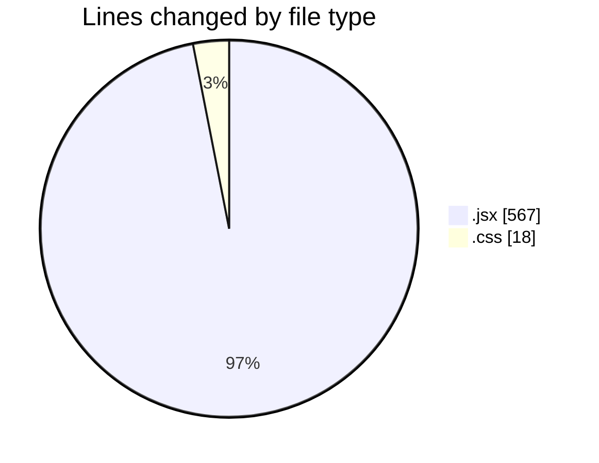
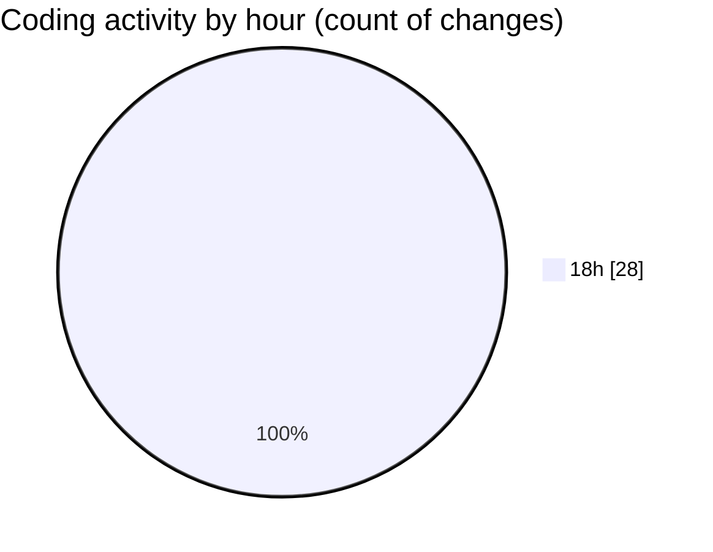

# React Ecom - Activity Summary 

## Overall Statistics

| Stat                   | Value                                                             |
| ---------------------- | ----------------------------------------------------------------- |
| **Lines Added** (➕)   | 563                                          |
| **Lines Removed** (➖) | 22                                        |
| **Net Change** (↕)    | 541                |
| **Active Time** (⌚)   | 37 minutes |

## Modified Files
- **Sidebar.jsx** (+27, -5)
- **Input.jsx** (+23, -0)
- **index.css** (+10, -8)
- **Category.jsx** (+50, -2)
- **App.jsx** (+82, -1)
- **Buttons.jsx** (+14, -0)
- **Price.jsx** (+46, -0)
- **Color.jsx** (+65, -0)
- **Recon.jsx** (+21, -0)
- **Color.jsx** (+65, -0)
- **Category.jsx** (+48, -0)
- **Price.jsx** (+46, -0)
- **Nav.jsx** (+66, -6)

## Visualizations

### By File Type (Lines Changed)

### By Hour (Estimated Activity Count)

> **Last Updated:** 5/27/2025, 6:47:13 PM