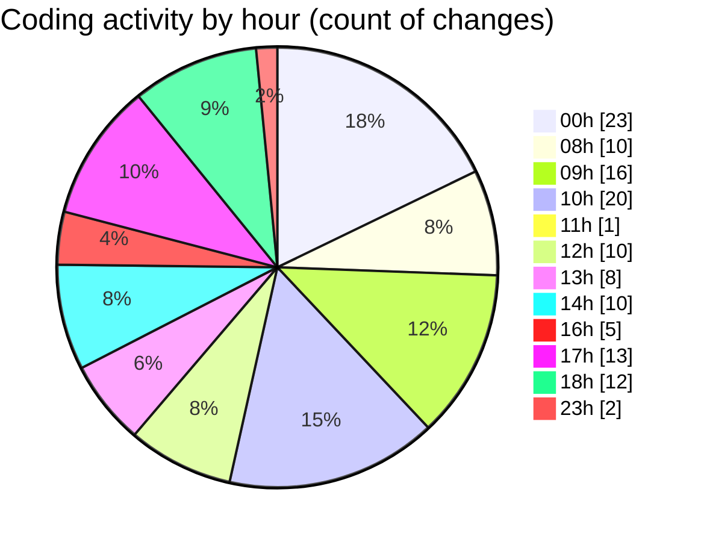

# advertise - Activity Summary 

## Overall Statistics

| Stat                   | Value                                                             |
| ---------------------- | ----------------------------------------------------------------- |
| **Lines Added** (➕)   | 3272                                          |
| **Lines Removed** (➖) | 915                                        |
| **Net Change** (↕)    | 2357                |
| **Active Time** (⌚)   | 185 minutes |

## Modified Files
- **package.json** (+3, -2)
- **Features.tsx** (+1269, -768)
- **card.tsx** (+80, -0)
- **page.tsx** (+31, -1)
- **Hero.tsx** (+416, -17)
- **layout.tsx** (+76, -6)
- **Nav.tsx** (+259, -13)
- **globals.css** (+152, -9)
- **HowItWorks.tsx** (+157, -5)
- **marquee.tsx** (+74, -0)
- **Preview.tsx** (+116, -26)
- **infinite-sider.tsx** (+92, -0)
- **Preveiw1.tsx** (+125, -0)
- **LogoIcon.tsx** (+115, -57)
- **Integrations.tsx** (+142, -11)
- **Footer.tsx** (+165, -0)

## Visualizations

### By File Type (Lines Changed)

### By Hour (Estimated Activity Count)

> **Last Updated:** 5/29/2025, 6:46:19 PM