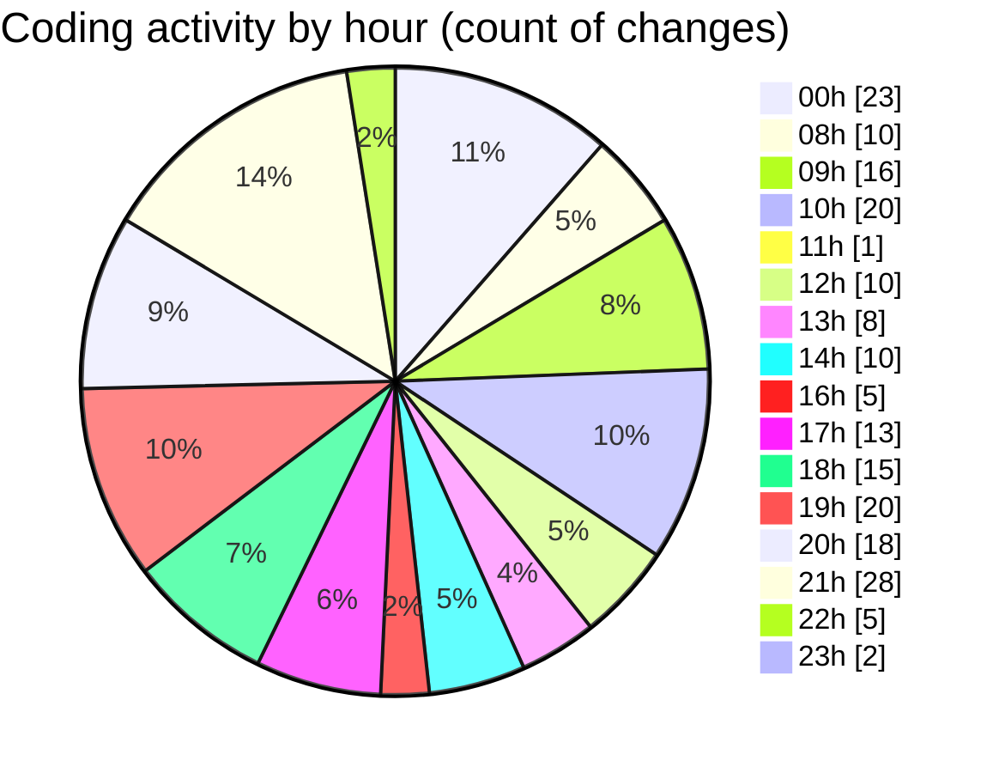

# advertise - Activity Summary 

## Overall Statistics

| Stat                   | Value                                                             |
| ---------------------- | ----------------------------------------------------------------- |
| **Lines Added** (➕)   | 4129                                          |
| **Lines Removed** (➖) | 1231                                        |
| **Net Change** (↕)    | 2898                |
| **Active Time** (⌚)   | 297 minutes |

## Modified Files
- **package.json** (+3, -2)
- **Features.tsx** (+1322, -812)
- **card.tsx** (+80, -0)
- **page.tsx** (+35, -1)
- **Hero.tsx** (+425, -17)
- **layout.tsx** (+82, -22)
- **Nav.tsx** (+259, -14)
- **globals.css** (+152, -9)
- **HowItWorks.tsx** (+247, -48)
- **marquee.tsx** (+74, -0)
- **Preview.tsx** (+116, -26)
- **infinite-sider.tsx** (+92, -0)
- **Preveiw1.tsx** (+125, -0)
- **LogoIcon.tsx** (+165, -57)
- **Integrations.tsx** (+174, -11)
- **Footer.tsx** (+184, -1)
- **aos.tsx** (+137, -21)
- **text-flip.tsx** (+105, -0)
- **AOSInit.tsx** (+116, -100)
- **Revenue.tsx** (+73, -25)
- **Support.tsx** (+96, -13)
- **fonts.ts** (+14, -0)
- **tailwind.config.ts** (+53, -52)

## Visualizations

### By File Type (Lines Changed)

### By Hour (Estimated Activity Count)

> **Last Updated:** 5/29/2025, 10:06:19 PM